# OpenClaw Architecture Analysis
## Comprehensive System Architecture with Mermaid Diagrams

---

## 1. HIGH-LEVEL SYSTEM ARCHITECTURE

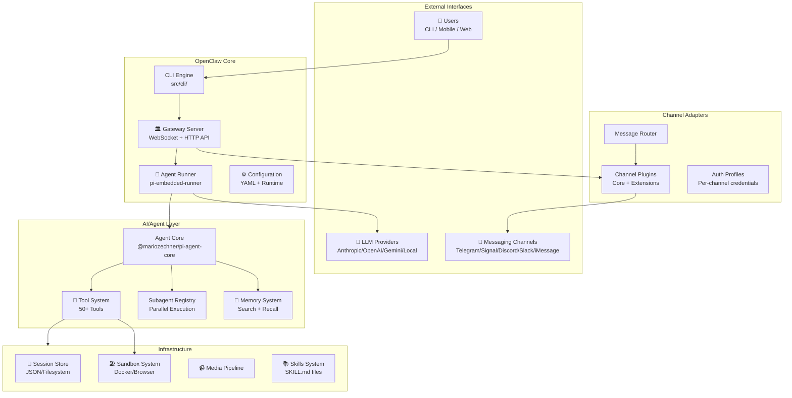

---

## 2. AGENT ARCHITECTURE - DEEP DIVE

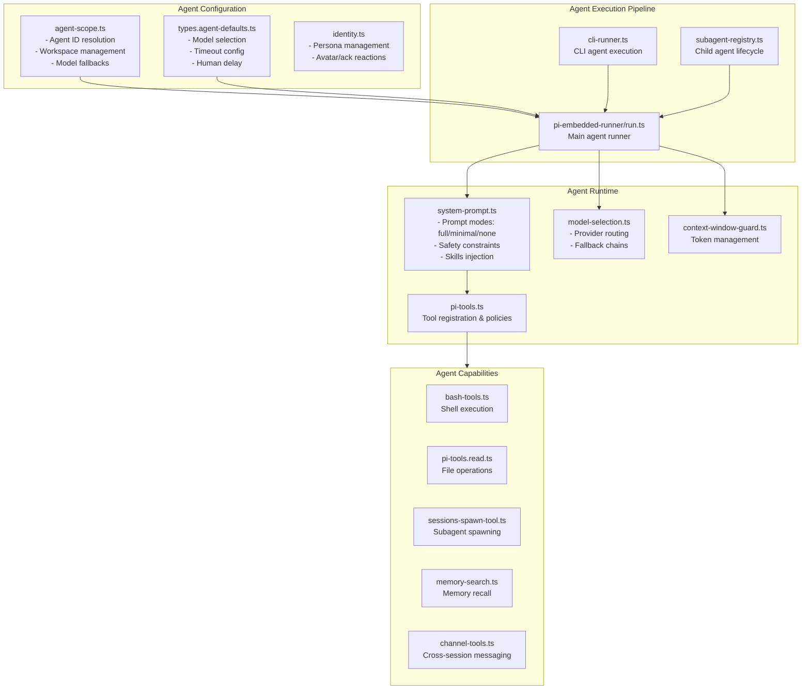

---

## 3. GATEWAY ARCHITECTURE

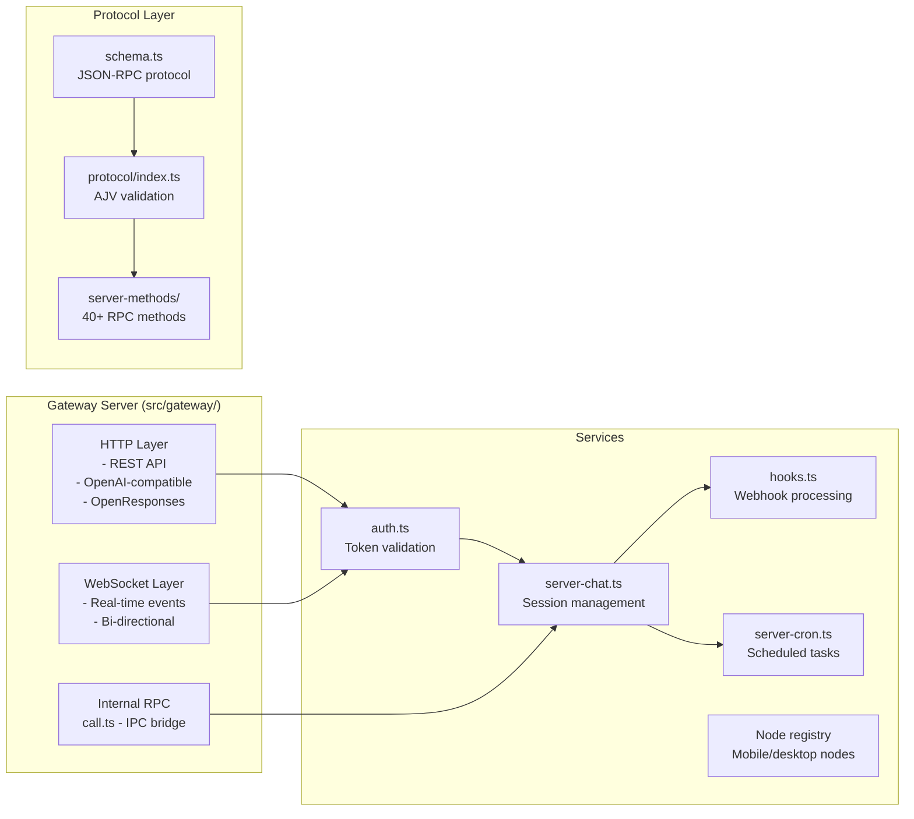

---

## 4. CHANNEL PLUGIN ARCHITECTURE

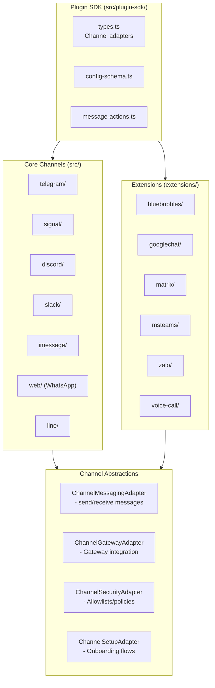

---

## 5. TOOL SYSTEM ARCHITECTURE

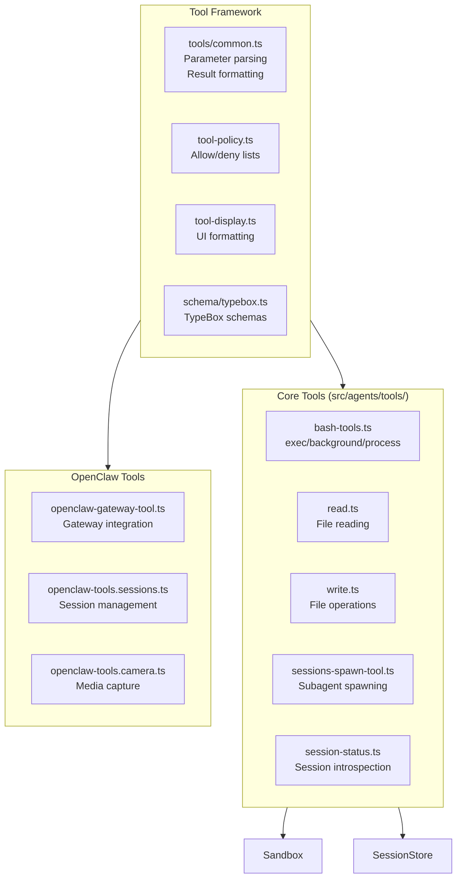

---

## 6. DATA FLOW - MESSAGE PROCESSING

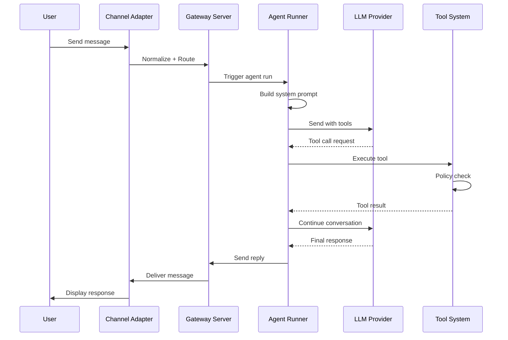

---

## 7. SUBAGENT / MULTI-AGENT PATTERN

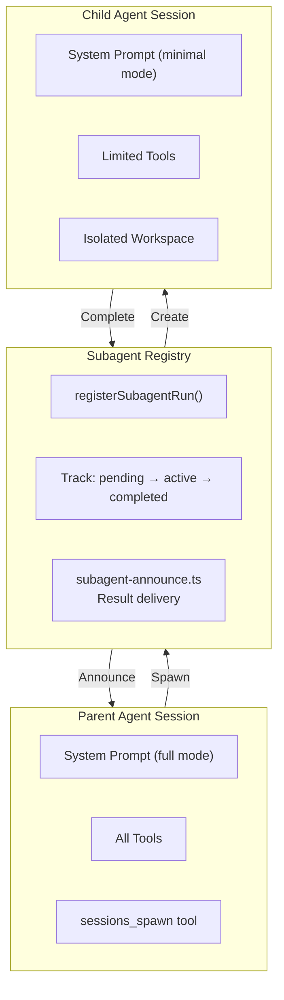

---

## 8. SECURITY & SANDBOX ARCHITECTURE

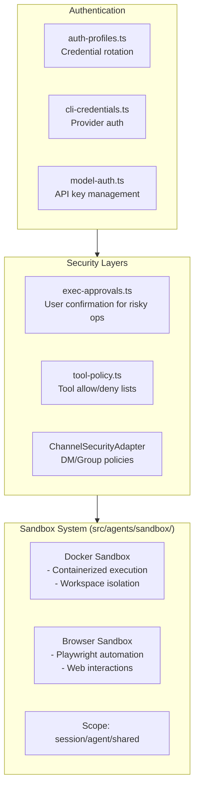

---

## 9. CONFIGURATION & STATE MANAGEMENT

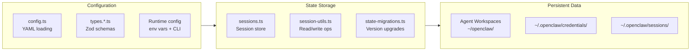

---

## 10. AI/LLM INTEGRATION PATTERNS

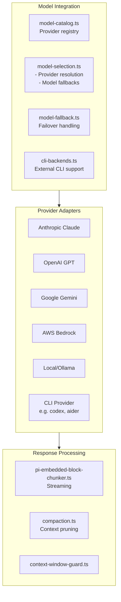

---

## 11. EXTENSION/PLUGIN ARCHITECTURE

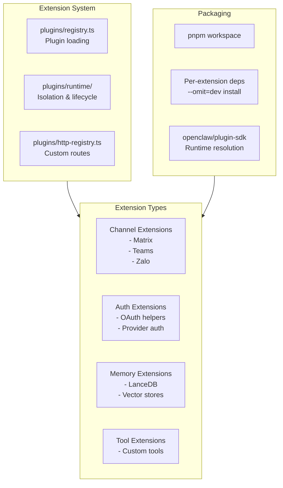

---

## AGENT SPECIFICATIONS SUMMARY

### Agent Types

| Type | Purpose | Context | Tools |
|------|---------|---------|-------|
| **Main Agent** | User-facing primary | Full system prompt | All tools |
| **Subagent** | Background tasks | Minimal prompt | Limited set |
| **Cron Agent** | Scheduled execution | Isolated session | Configurable |
| **Hook Agent** | Webhook processing | Request context | Webhook tools |

### Key Agent Capabilities

- **Multi-model**: Supports 15+ LLM providers with fallback chains
- **Tool use**: 50+ built-in tools (bash, file, web, camera, etc.)
- **Subagents**: Parallel task execution with `sessions_spawn`
- **Memory**: Semantic search across conversation history
- **Sandboxing**: Docker/browser isolation for unsafe operations
- **Multi-channel**: Unified interface across 15+ messaging platforms

### Agent Lifecycle

1. **Initialization**: Load config → Resolve agent ID → Setup workspace
2. **Prompt Building**: Inject skills → Apply identity → Add safety rules
3. **Model Selection**: Choose provider → Apply fallbacks → Auth resolution
4. **Execution**: Stream response → Handle tool calls → Manage context window
5. **Completion**: Persist session → Cleanup → Announce (subagents)

---

## KEY ARCHITECTURAL PATTERNS

1. **Adapter Pattern**: Channel plugins implement standard adapters
2. **Registry Pattern**: Dynamic tool/subagent/skill registration
3. **Lane Pattern**: Serialized execution queues per session/global
4. **Policy Pattern**: Configurable tool/channel access controls
5. **Fallback Pattern**: Graceful degradation across models/auth profiles
6. **Event-Driven**: Agent events, diagnostic events, lifecycle hooks

---

## FILE ORGANIZATION

```
src/
├── agents/           # Agent runtime, tools, execution
├── auto-reply/       # Message handling, chunking, templating
├── channels/         # Channel abstractions + core implementations
├── cli/              # CLI commands and UI
├── commands/         # High-level command implementations
├── config/           # Configuration types and loading
├── gateway/          # Gateway server, protocol, methods
├── infra/            # Infrastructure utilities
├── media/            # Media processing pipeline
├── plugins/          # Plugin system
├── providers/        # LLM provider utilities
└── [channels]/       # Per-channel implementations
```

Extensions live in `extensions/` as separate workspace packages.
