# OpenClaw Deep Architecture Analysis
## Expert AI/LLM Agent System with Detailed Specifications

---

## 1. CLASS DIAGRAM - CORE AGENT SYSTEM

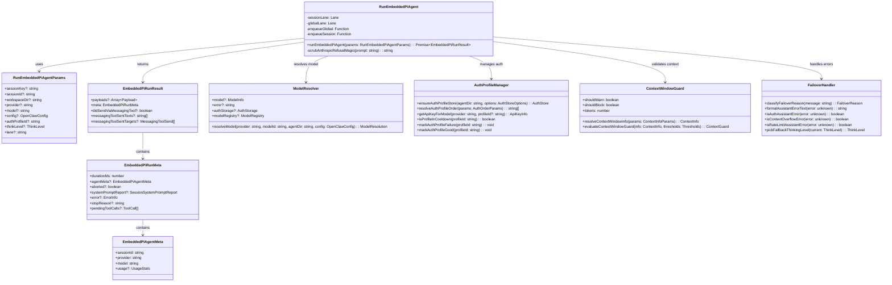

---

## 2. SEQUENCE DIAGRAM - AGENT EXECUTION LIFECYCLE

```mermaid
sequenceDiagram
    participant Client as Gateway Client
    participant Gateway as Gateway Server
    participant Session as Session Manager
    participant Agent as runEmbeddedPiAgent
    participant ModelResolver as Model Resolver
    participant AuthManager as Auth Profile Manager
    participant ContextGuard as Context Window Guard
    participant LLM as LLM Provider
    participant Tools as Tool System
    participant Sandbox as Sandbox System

    Client->>Gateway: chat.send(message)
    Gateway->>Session: resolve session
    Session->>Agent: runEmbeddedPiAgent(params)
    
    Agent->>ModelResolver: resolveModel(provider, model)
    ModelResolver-->>Agent: { model, authStorage, registry }
    
    Agent->>ContextGuard: evaluateContextWindowGuard()
    ContextGuard-->>Agent: { shouldWarn, shouldBlock, tokens }
    
    alt Context window too small
        Agent->>Client: error: "Context window too small"
    else Context window valid
        Agent->>AuthManager: resolveAuthProfileOrder()
        AuthManager-->>Agent: profileOrder[]
        
        loop Auth profile failover
            Agent->>AuthManager: getApiKeyForModel(profile)
            AuthManager-->>Agent: apiKeyInfo
            
            Agent->>LLM: create conversation with tools
            alt Auth error / rate limit
                Agent->>AuthManager: markAuthProfileFailure()
                Agent->>AuthManager: isProfileInCooldown()
                continue
            else Success
                break
            end
        end
        
        LLM->>Agent: streaming response
        
        loop Tool call handling
            LLM->>Agent: tool_call request
            Agent->>Tools: execute tool call
            Tools->>Sandbox: if sandboxed execution
            Sandbox-->>Tools: result
            Tools-->>Agent: tool result
            Agent->>LLM: continue with tool result
        end
        
        LLM-->>Agent: final response
        Agent->>Session: update session state
        Agent-->>Gateway: EmbeddedPiRunResult
        Gateway-->>Client: chat response
    end
```

---

## 3. CLASS DIAGRAM - GATEWAY SERVER ARCHITECTURE

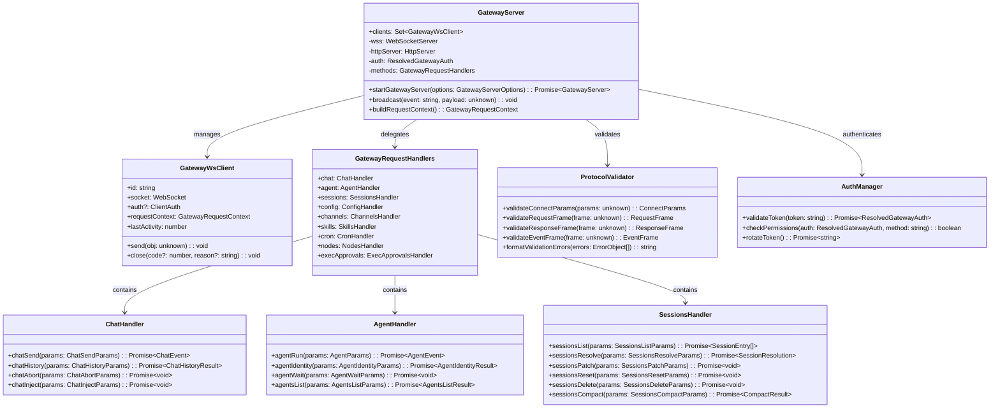

---

## 4. SEQUENCE DIAGRAM - WEBSOCKET CONNECTION LIFECYCLE

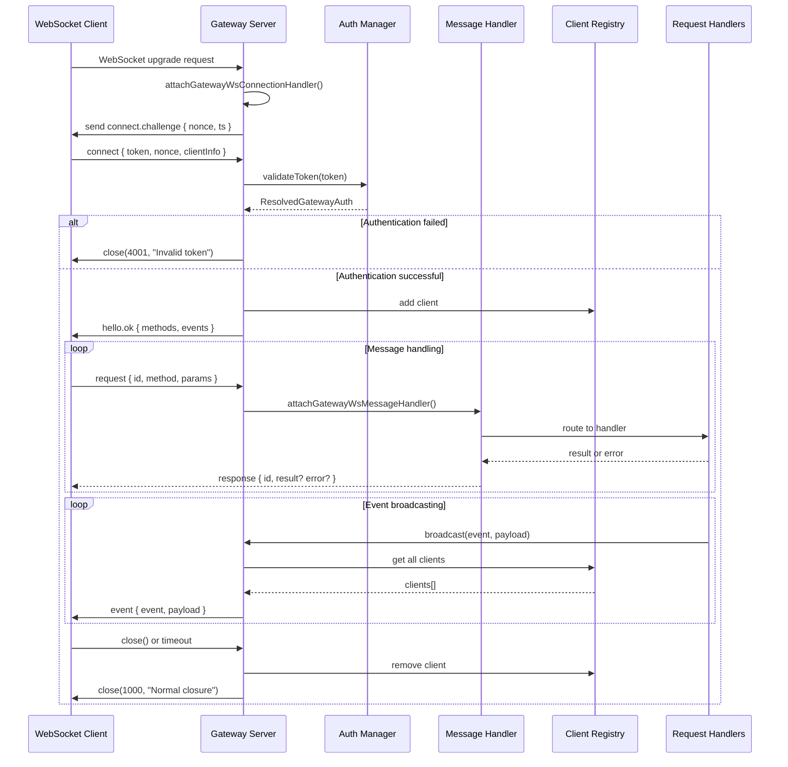

---

## 5. CLASS DIAGRAM - CHANNEL PLUGIN ARCHITECTURE

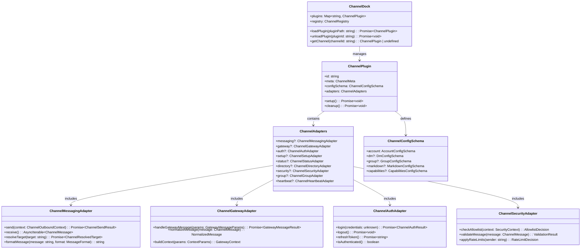

---

## 6. SEQUENCE DIAGRAM - MESSAGE PROCESSING WORKFLOW

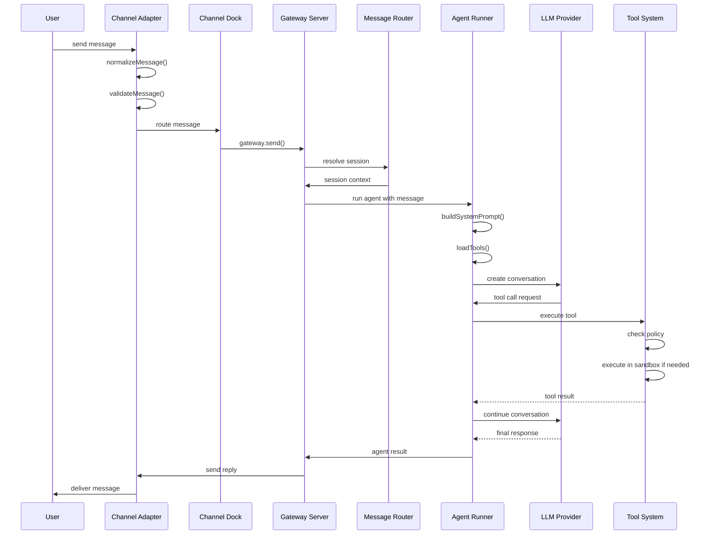

---

## 7. CLASS DIAGRAM - TOOL SYSTEM ARCHITECTURE

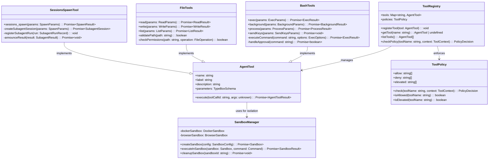

---

## 8. SEQUENCE DIAGRAM - SUBAGENT SPAWNING WORKFLOW

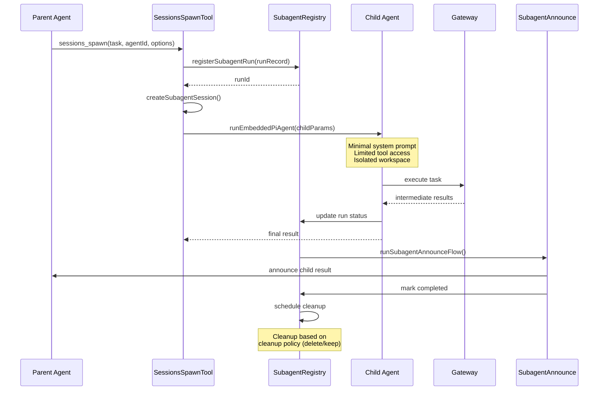

---

## 9. CLASS DIAGRAM - AUTHENTICATION & SECURITY

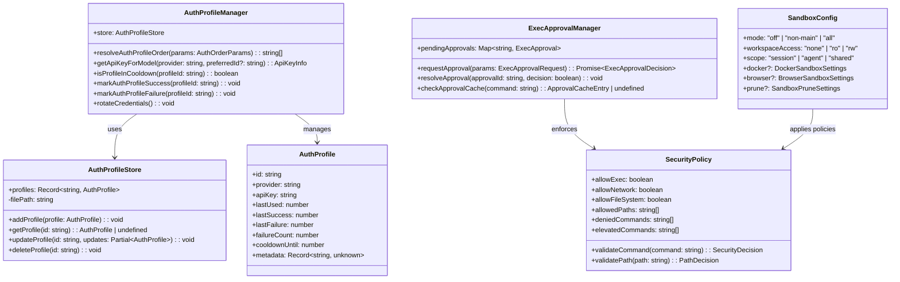

---

## 10. DETAILED WORKFLOW SPECIFICATIONS

### 10.1 Agent Initialization Workflow

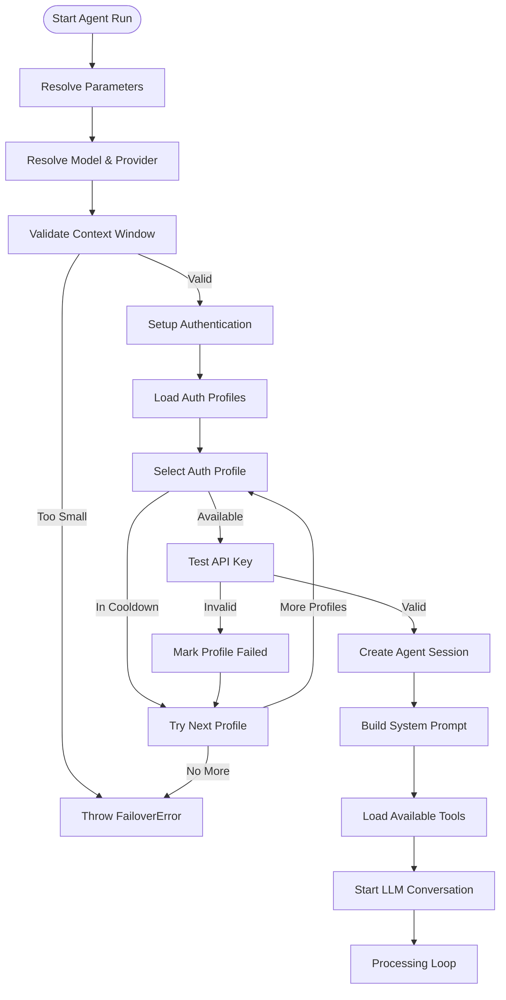

### 10.2 Tool Execution Workflow

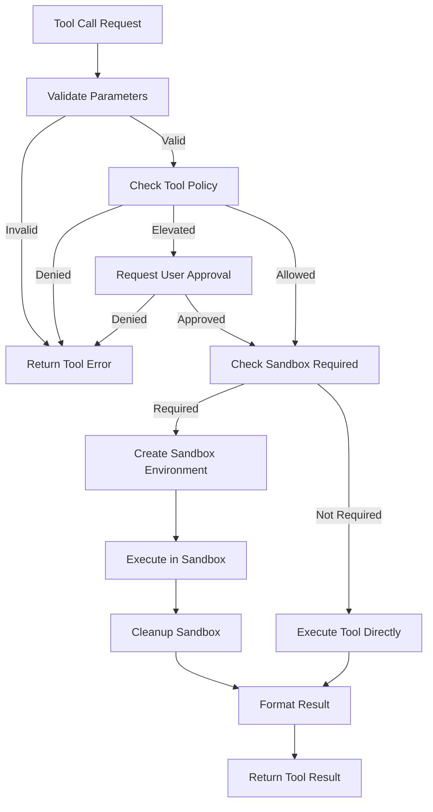

### 10.3 Message Routing Workflow

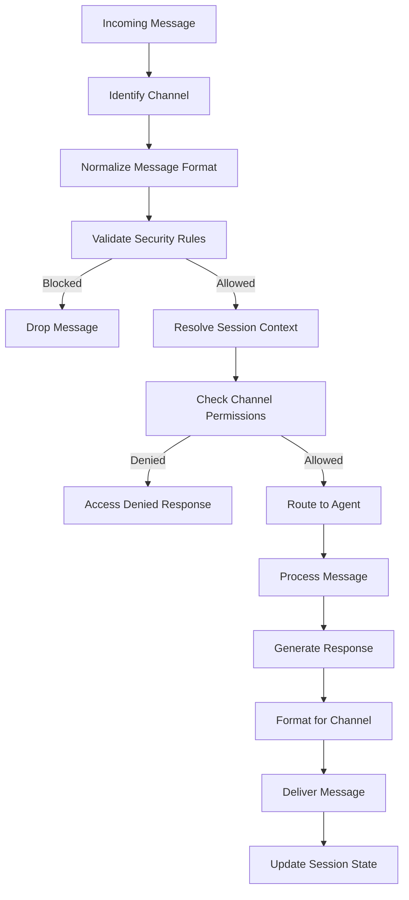

---

## 11. PERFORMANCE & SCALABILITY SPECIFICATIONS

### 11.1 Concurrency Model

- **Lane-based Execution**: Each session runs in isolated lanes
- **Global Lane**: Serialized operations across all sessions
- **Session Lane**: Per-session serialized operations
- **Subagent Isolation**: Child agents run in separate lanes

### 11.2 Resource Management

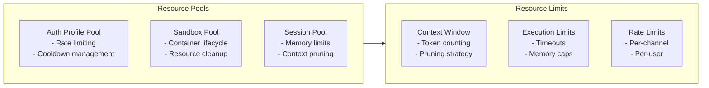

### 11.3 Caching Strategy

- **Model Catalog Cache**: Provider/model information
- **Auth Profile Cache**: Credential validation results
- **Session Cache**: Active session states
- **Tool Result Cache**: Expensive operation results

---

## 12. ERROR HANDLING & FAILOVER SPECIFICATIONS

### 12.1 Error Classification

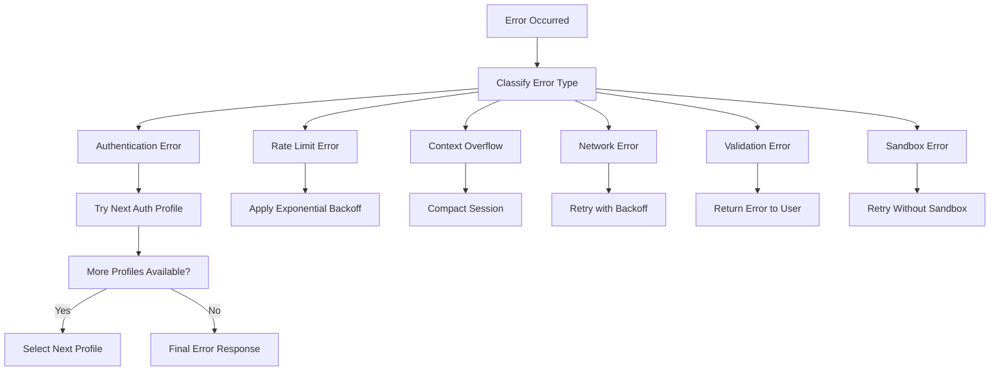

### 12.2 Failover Strategies

1. **Auth Profile Failover**: Rotate through available profiles
2. **Model Failover**: Fallback to alternative models
3. **Context Failover**: Compact or reset conversation
4. **Network Failover**: Retry with exponential backoff
5. **Sandbox Failover**: Graceful degradation to non-sandboxed

---

## 13. MONITORING & OBSERVABILITY

### 13.1 Event Types

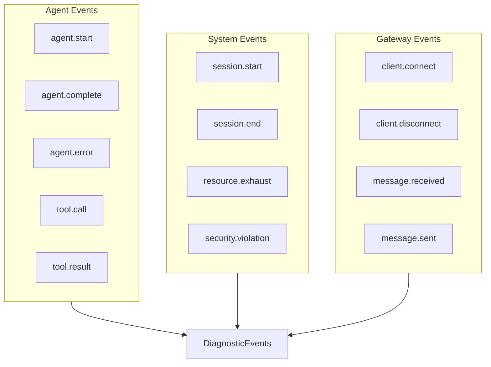

### 13.2 Metrics Collection

- **Performance Metrics**: Response times, token usage, tool execution times
- **Error Metrics**: Error rates, failover counts, auth failures
- **Resource Metrics**: Memory usage, CPU usage, sandbox utilization
- **Business Metrics**: Message volume, session duration, user engagement

---

## 14. SECURITY ARCHITECTURE DEEP DIVE

### 14.1 Threat Model

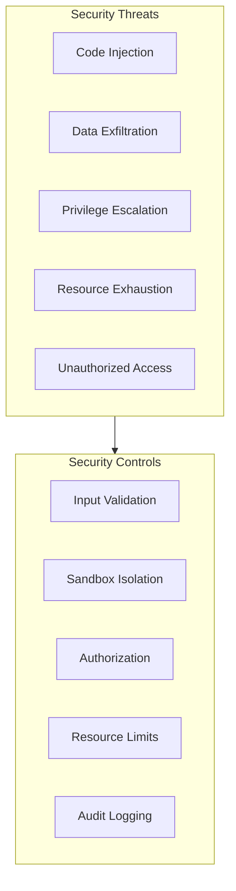

### 14.2 Security Boundaries

1. **Channel Boundary**: Message validation and sanitization
2. **Gateway Boundary**: Authentication and authorization
3. **Agent Boundary**: Tool policy enforcement
4. **Sandbox Boundary**: Process and filesystem isolation
5. **Network Boundary**: Egress filtering and monitoring

---

## 15. DEPLOYMENT ARCHITECTURE

### 15.1 Component Deployment

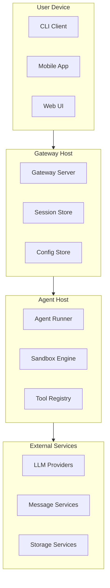

### 15.2 Scaling Considerations

- **Horizontal Scaling**: Multiple gateway instances behind load balancer
- **Vertical Scaling**: Resource allocation per agent workload
- **Session Affinity**: Sticky sessions for stateful conversations
- **Resource Pooling**: Shared sandbox and tool resources

---

## CONCLUSION

OpenClaw represents a sophisticated multi-agent AI system with:

- **Modular Architecture**: Clean separation of concerns with well-defined interfaces
- **Robust Execution Model**: Lane-based concurrency with proper isolation
- **Comprehensive Security**: Multiple security boundaries and validation layers
- **Extensible Design**: Plugin system for channels and tools
- **Production Ready**: Monitoring, failover, and resource management

The architecture demonstrates enterprise-grade patterns for building scalable, secure AI agent systems that can interact with multiple messaging platforms while maintaining safety and reliability.
