# Reference Architecture for Agentic AI Systems
## Expert Design Patterns & Frameworks for Sustainable, Self-Governed AI

---

## 1. VISION & ARCHITECTURAL PHILOSOPHY

### 1.1 Core Principles

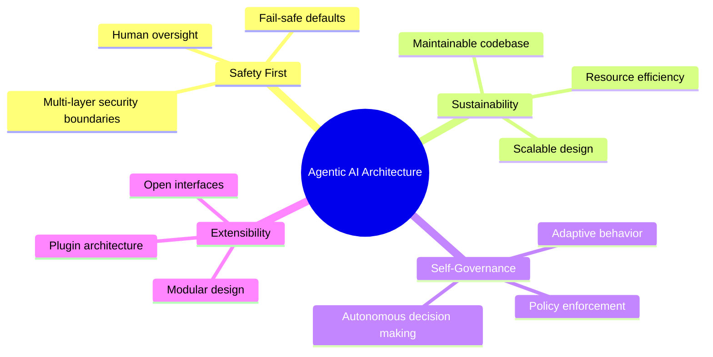

### 1.2 Architectural Tenets

| Tenet | Description | Implementation |
|--------|-------------|----------------|
| **Defense in Depth** | Multiple security layers | Channel → Gateway → Agent → Tool → Sandbox |
| **Graceful Degradation** | System continues operating during failures | Model fallbacks, auth rotation, sandbox bypass |
| **Observable by Design** | Built-in monitoring and telemetry | Events, metrics, health checks |
| **Policy-Driven** | Configuration controls behavior | Tool policies, channel policies, security policies |
| **Isolation by Default** | Components operate in isolated contexts | Session lanes, sandbox containers, auth profiles |

---

## 2. REFERENCE ARCHITECTURE PATTERNS

### 2.1 Core Architectural Patterns

#### Pattern 1: Multi-Layer Agent Runtime

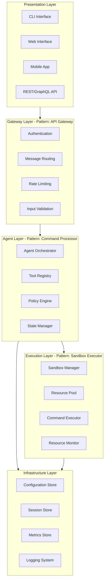

#### Pattern 2: Plugin-Based Channel System

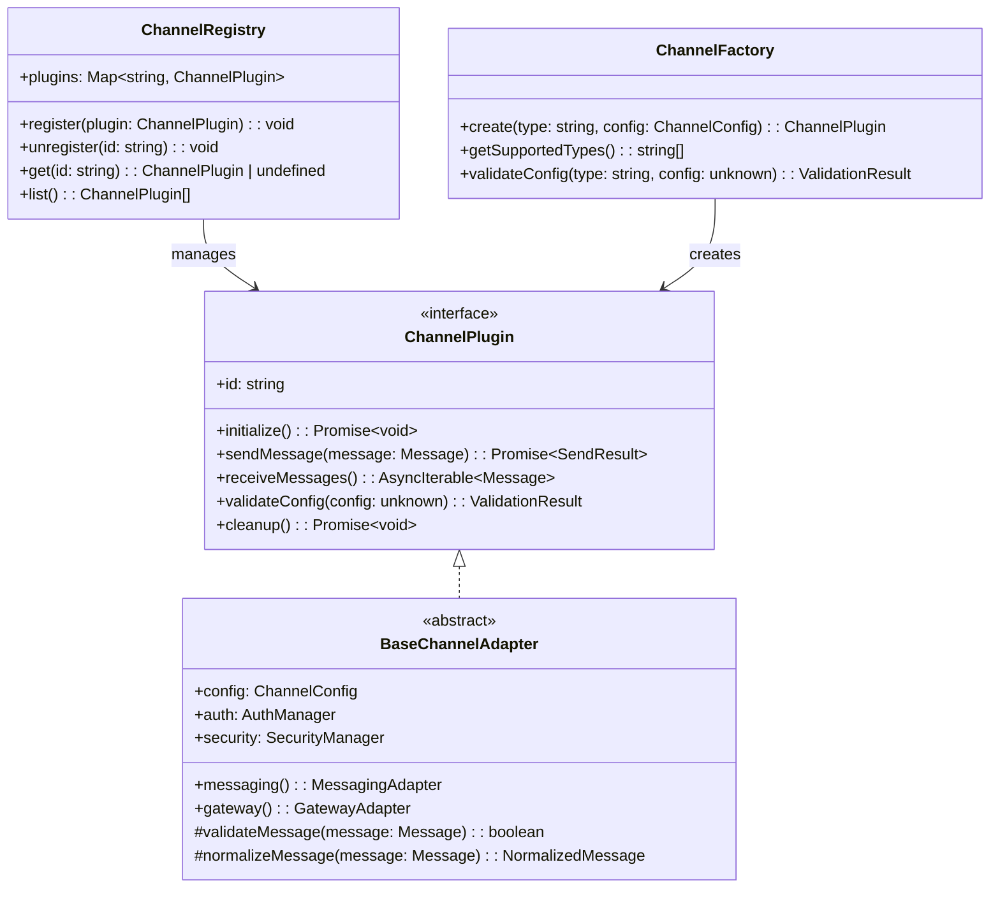

#### Pattern 3: Lane-Based Concurrency

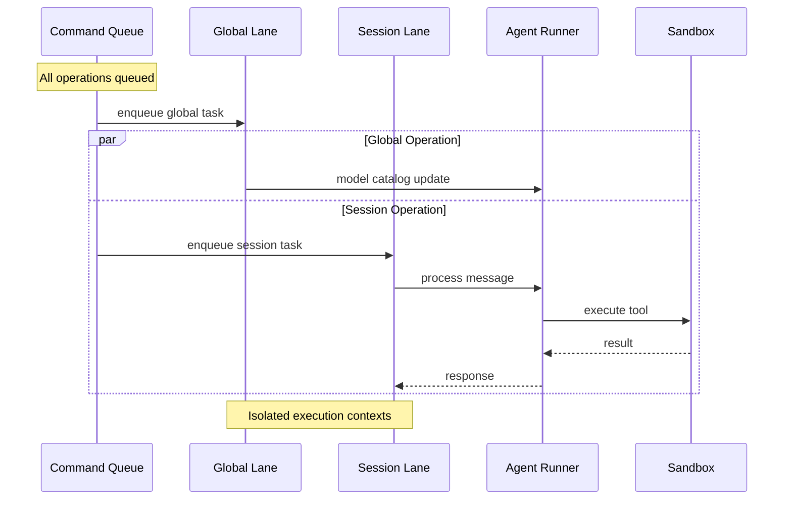

### 2.2 Design Patterns Catalog

#### Creational Patterns

| Pattern | Use Case | OpenClaw Example |
|---------|----------|------------------|
| **Factory Method** | Creating channel plugins | `ChannelFactory.create()` |
| **Builder** | Complex agent configuration | `AgentConfigBuilder` |
| **Singleton** | Global configuration store | `ConfigManager.getInstance()` |
| **Registry** | Dynamic component registration | `ToolRegistry`, `ChannelRegistry` |

#### Structural Patterns

| Pattern | Use Case | OpenClaw Example |
|---------|----------|------------------|
| **Adapter** | Channel integration | `ChannelMessagingAdapter` |
| **Decorator** | Tool policy enforcement | `PolicyToolDecorator` |
| **Facade** | Simplified API access | `GatewayFacade` |
| **Proxy** | Auth profile management | `AuthProfileProxy` |

#### Behavioral Patterns

| Pattern | Use Case | OpenClaw Example |
|---------|----------|------------------|
| **Command** | Tool execution | `ToolCommand.execute()` |
| **Strategy** | Model selection | `ModelSelectionStrategy` |
| **Observer** | Event system | `AgentEventEmitter` |
| **State** | Session management | `SessionStateMachine` |
| **Chain of Responsibility** | Message processing | `MessageProcessingChain` |

---

## 3. SUSTAINABLE ARCHITECTURE FRAMEWORKS

### 3.1 Resource Management Framework

```mermaid
flowchart LR
    subgraph ResourceTypes["Resource Types"]
        Compute[Compute Resources<br/>CPU, Memory]
        Network[Network Resources<br/>Bandwidth, Connections]
        Storage[Storage Resources<br/>Disk, Database]
        Tokens[Token Resources<br/>LLM Context]
        Credentials[Credential Resources<br/>API Keys, Auth]
    end

    subgraph Management["Resource Management"]
        Pooling[Resource Pooling<br/>- Connection pools<br/>- Token pools<br/>- Credential rotation]
        Limiting[Rate Limiting<br/>- Per-user limits<br/>- Per-channel limits<br/>- Global limits]
        Monitoring[Resource Monitoring<br/>- Usage metrics<br/>- Health checks<br/>- Alerting]
        Cleanup[Resource Cleanup<br/>- Session pruning<br/>- Cache eviction<br/>- Log rotation]
    end

    subgraph Policies["Resource Policies"]
        Quotas[Usage Quotas]
        Prioritization[Priority Queuing]
        Failover[Graceful Degradation]
        Recovery[Auto-Recovery]
    end

    ResourceTypes --> Management
    Management --> Policies
```

### 3.2 Self-Governance Framework

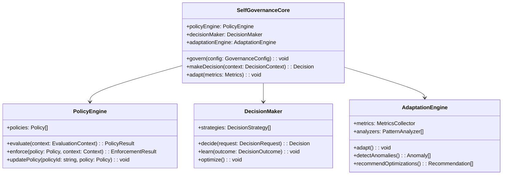

### 3.3 Security Governance Framework

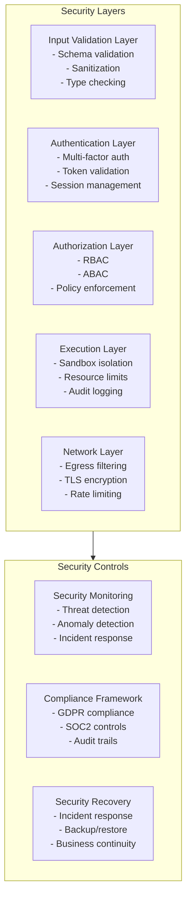

---

## 4. EXPERT IMPLEMENTATION GUIDELINES

### 4.1 Code Architecture Guidelines

#### Guideline 1: Dependency Inversion Principle

```typescript
// ❌ Bad: Direct dependency on concrete implementation
class AgentRunner {
  private anthropic = new AnthropicClient();
  private openai = new OpenAIClient();
}

// ✅ Good: Dependency on abstraction
interface LLMProvider {
  chat(messages: Message[]): Promise<ChatResponse>;
}

class AgentRunner {
  constructor(private providers: Map<string, LLMProvider>) {}
}
```

#### Guideline 2: Circuit Breaker Pattern

```typescript
class CircuitBreaker {
  private failures = 0;
  private state: 'CLOSED' | 'OPEN' | 'HALF_OPEN' = 'CLOSED';
  
  async execute<T>(operation: () => Promise<T>): Promise<T> {
    if (this.state === 'OPEN') {
      if (Date.now() - this.lastFailure > this.timeout) {
        this.state = 'HALF_OPEN';
      } else {
        throw new Error('Circuit breaker is OPEN');
      }
    }
    
    try {
      const result = await operation();
      this.onSuccess();
      return result;
    } catch (error) {
      this.onFailure();
      throw error;
    }
  }
}
```

#### Guideline 3: Observer Pattern for Events

```typescript
interface AgentEvent {
  type: string;
  payload: unknown;
  timestamp: number;
}

interface EventObserver {
  onEvent(event: AgentEvent): void;
}

class AgentEventEmitter {
  private observers: Map<string, EventObserver[]> = new Map();
  
  subscribe(eventType: string, observer: EventObserver): void {
    const observers = this.observers.get(eventType) || [];
    observers.push(observer);
    this.observers.set(eventType, observers);
  }
  
  emit(event: AgentEvent): void {
    const observers = this.observers.get(event.type) || [];
    observers.forEach(observer => observer.onEvent(event));
  }
}
```

### 4.2 Configuration Management Guidelines

#### Guideline 1: Hierarchical Configuration

```yaml
# Global defaults
defaults:
  model:
    provider: "anthropic"
    model: "claude-3-sonnet"
    timeout: 30000
  security:
    sandbox: true
    approval_required: true

# Agent-specific overrides
agents:
  - id: "coding-assistant"
    model:
      provider: "openai"
      model: "gpt-4"
    security:
      sandbox: false
    tools:
      allow: ["read", "write", "exec"]
      deny: ["network"]

# Channel-specific settings
channels:
  telegram:
    rate_limit: 10  # messages per minute
    markdown: true
  discord:
    rate_limit: 5
    markdown: false
```

#### Guideline 2: Policy as Code

```typescript
interface SecurityPolicy {
  name: string;
  rules: PolicyRule[];
  actions: PolicyAction[];
}

interface PolicyRule {
  condition: string;  // CEL expression
  effect: 'allow' | 'deny';
}

const securityPolicy: SecurityPolicy = {
  name: "default-security",
  rules: [
    {
      condition: "tool.name in ['bash', 'exec'] && user.role != 'admin'",
      effect: "deny"
    },
    {
      condition: "request.channel == 'discord' && message.length > 4000",
      effect: "deny"
    }
  ],
  actions: [
    {
      type: "log",
      level: "warn",
      message: "Security policy violation: ${rule.condition}"
    },
    {
      type: "notify",
      channel: "security-alerts"
    }
  ]
};
```

### 4.3 Error Handling Guidelines

#### Guideline 1: Typed Error System

```typescript
abstract class AgentError extends Error {
  abstract readonly code: string;
  abstract readonly category: 'auth' | 'network' | 'validation' | 'execution';
  abstract readonly retryable: boolean;
}

class AuthenticationError extends AgentError {
  readonly code = 'AUTH_FAILED';
  readonly category = 'auth';
  readonly retryable = true;
}

class ValidationError extends AgentError {
  readonly code = 'INVALID_INPUT';
  readonly category = 'validation';
  readonly retryable = false;
}

class ErrorHandler {
  handle(error: AgentError): void {
    if (error.retryable) {
      this.scheduleRetry(error);
    } else {
      this.notifyUser(error);
    }
    this.logError(error);
  }
}
```

#### Guideline 2: Graceful Degradation

```typescript
class FallbackChain {
  constructor(private strategies: FallbackStrategy[]) {}
  
  async execute<T>(request: Request): Promise<T> {
    for (const strategy of this.strategies) {
      try {
        return await strategy.execute(request);
      } catch (error) {
        this.logFallback(strategy, error);
        continue;
      }
    }
    throw new Error('All fallback strategies failed');
  }
}

// Usage: Model fallback chain
const modelFallback = new FallbackChain([
  new AnthropicStrategy(),
  new OpenAIStrategy(),
  new LocalModelStrategy(),
  new SimpleResponseStrategy()  // Ultimate fallback
]);
```

---

## 5. SCALABILITY PATTERNS

### 5.1 Horizontal Scaling Patterns

#### Pattern 1: Stateless Gateway

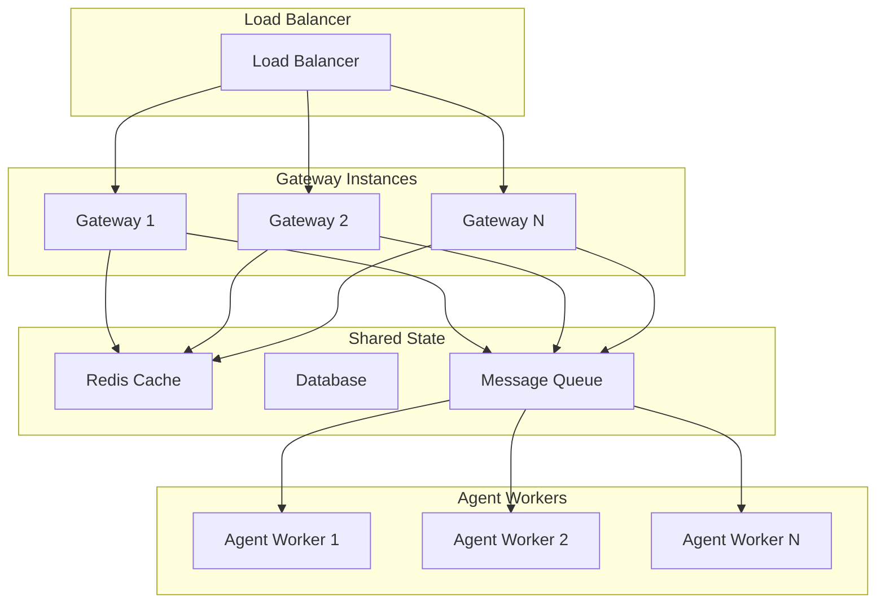

#### Pattern 2: Session Affinity

```typescript
class SessionRouter {
  private sessionMap = new Map<string, string>(); // sessionId -> gatewayId
  
  route(sessionId: string): string {
    const gatewayId = this.sessionMap.get(sessionId);
    if (gatewayId && this.isGatewayHealthy(gatewayId)) {
      return gatewayId;
    }
    
    const newGateway = this.selectHealthyGateway();
    this.sessionMap.set(sessionId, newGateway);
    return newGateway;
  }
  
  onSessionEnd(sessionId: string): void {
    this.sessionMap.delete(sessionId);
  }
}
```

### 5.2 Vertical Scaling Patterns

#### Pattern 1: Resource Pooling

```typescript
class ResourcePool<T> {
  private available: T[] = [];
  private inUse = new Set<T>();
  
  async acquire(): Promise<T> {
    if (this.available.length > 0) {
      const resource = this.available.pop()!;
      this.inUse.add(resource);
      return resource;
    }
    
    return await this.createResource();
  }
  
  release(resource: T): void {
    if (this.inUse.has(resource)) {
      this.inUse.delete(resource);
      this.available.push(resource);
    }
  }
}

class SandboxPool extends ResourcePool<Sandbox> {
  protected async createResource(): Promise<Sandbox> {
    return await Sandbox.create();
  }
}
```

#### Pattern 2: Adaptive Resource Management

```typescript
class AdaptiveResourceManager {
  private metrics = new MetricsCollector();
  private thresholds = new Map<string, number>();
  
  async manageResources(): Promise<void> {
    const usage = this.metrics.getCurrentUsage();
    
    for (const [resource, current] of usage.entries()) {
      const threshold = this.thresholds.get(resource) || 0.8;
      
      if (current > threshold) {
        await this.scaleUp(resource);
      } else if (current < threshold * 0.5) {
        await this.scaleDown(resource);
      }
    }
  }
  
  private async scaleUp(resource: string): Promise<void> {
    // Add more resources
  }
  
  private async scaleDown(resource: string): Promise<void> {
    // Remove excess resources
  }
}
```

---

## 6. MONITORING & OBSERVABILITY FRAMEWORK

### 6.1 Observability Stack

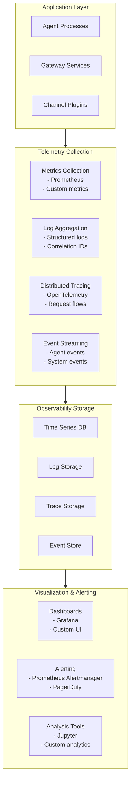

### 6.2 Metrics Framework

#### Core Metrics Categories

| Category | Key Metrics | Alert Thresholds |
|----------|-------------|------------------|
| **Performance** | Response time, throughput, error rate | P95 > 5s, Error rate > 5% |
| **Resource** | CPU, memory, disk, network usage | CPU > 80%, Memory > 85% |
| **Business** | Messages processed, sessions active, tool usage | Queue depth > 1000 |
| **Security** | Auth failures, policy violations, anomalous access | Auth failures > 10/min |

#### Metrics Implementation

```typescript
class MetricsCollector {
  private registry = new Registry();
  
  // Counter metrics
  private messageCounter = new Counter({
    name: 'messages_total',
    help: 'Total number of messages processed',
    labelNames: ['channel', 'status']
  });
  
  // Histogram metrics
  private responseTime = new Histogram({
    name: 'response_time_seconds',
    help: 'Response time in seconds',
    labelNames: ['operation'],
    buckets: [0.1, 0.5, 1, 2, 5, 10]
  });
  
  // Gauge metrics
  private activeSessions = new Gauge({
    name: 'active_sessions',
    help: 'Number of active sessions'
  });
  
  recordMessage(channel: string, status: string): void {
    this.messageCounter.inc({ channel, status });
  }
  
  recordResponseTime(operation: string, duration: number): void {
    this.responseTime.observe({ operation }, duration);
  }
  
  setActiveSessions(count: number): void {
    this.activeSessions.set(count);
  }
}
```

---

## 7. SECURITY ARCHITECTURE DEEP DIVE

### 7.1 Zero Trust Security Model

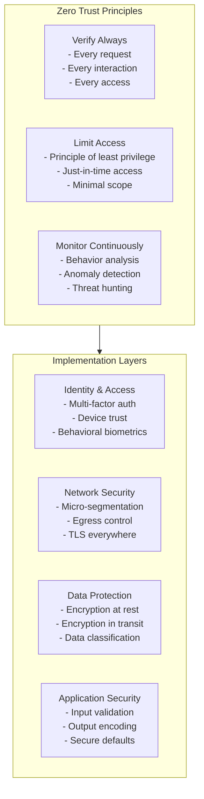

### 7.2 Security Controls Implementation

#### Input Validation Framework

```typescript
class InputValidator {
  private schemas = new Map<string, Schema>();
  
  validate(input: unknown, schemaName: string): ValidationResult {
    const schema = this.schemas.get(schemaName);
    if (!schema) {
      throw new Error(`Schema not found: ${schemaName}`);
    }
    
    return this.validateWithSchema(input, schema);
  }
  
  private validateWithSchema(input: unknown, schema: Schema): ValidationResult {
    // Implement JSON Schema validation
    // Check for injection patterns
    // Validate data types and ranges
    // Sanitize output
  }
}

// Usage
const validator = new InputValidator();
const result = validator.validate(userInput, 'message-schema');
```

#### Authorization Framework

```typescript
interface Policy {
  id: string;
  effect: 'allow' | 'deny';
  resources: string[];
  actions: string[];
  conditions?: PolicyCondition[];
}

class PolicyEngine {
  constructor(private policies: Policy[]) {}
  
  evaluate(request: AccessRequest): PolicyDecision {
    for (const policy of this.policies) {
      if (this.matches(policy, request)) {
        return {
          effect: policy.effect,
          policyId: policy.id
        };
      }
    }
    
    return { effect: 'deny', policyId: 'default-deny' };
  }
  
  private matches(policy: Policy, request: AccessRequest): boolean {
    return this.matchesResource(policy, request.resource) &&
           this.matchesAction(policy, request.action) &&
           this.matchesConditions(policy, request);
  }
}
```

---

## 8. TESTING STRATEGY FRAMEWORK

### 8.1 Testing Pyramid

```mermaid
pyramid
    title Testing Strategy Pyramid
    
    "E2E Tests<br/>- User workflows<br/>- Integration scenarios<br/>- Performance tests" : 10
    
    "Integration Tests<br/>- API tests<br/>- Database tests<br/>- Service integration" : 30
    
    "Unit Tests<br/>- Function tests<br/>- Class tests<br/>- Module tests" : 70
```

### 8.2 Test Architecture

#### Test Categories

| Level | Focus | Tools | Examples |
|-------|-------|-------|----------|
| **Unit** | Individual functions/classes | Jest, Vitest | Tool execution, validation logic |
| **Integration** | Component interactions | TestContainers, Mock Services | Gateway + Agent, Channel + Gateway |
| **System** | End-to-end workflows | Playwright, Cypress | User message → Agent response |
| **Performance** | Load, stress, scalability | K6, Artillery | Concurrent sessions, tool execution |
| **Security** | Vulnerability assessment | OWASP ZAP, Custom tests | Input validation, auth bypass |

#### Test Implementation Example

```typescript
describe('Agent Runner Integration', () => {
  let testGateway: TestGateway;
  let mockLLM: MockLLMProvider;
  let agentRunner: AgentRunner;
  
  beforeEach(async () => {
    mockLLM = new MockLLMProvider();
    testGateway = new TestGateway();
    agentRunner = new AgentRunner({
      llmProvider: mockLLM,
      gateway: testGateway
    });
  });
  
  it('should process message end-to-end', async () => {
    // Arrange
    const message = createTestMessage('Hello, world!');
    mockLLM.setResponse('Hello! How can I help?');
    
    // Act
    const response = await agentRunner.processMessage(message);
    
    // Assert
    expect(response.text).toBe('Hello! How can I help?');
    expect(mockLLM.getCallCount()).toBe(1);
    expect(testGateway.getLastSentMessage()).toEqual(response);
  });
  
  it('should handle tool execution', async () => {
    // Arrange
    const message = createTestMessage('List files in current directory');
    mockLLM.setToolCall('read', { path: '.' });
    mockLLM.setResponse('Files: file1.txt, file2.txt');
    
    // Act
    const response = await agentRunner.processMessage(message);
    
    // Assert
    expect(response.text).toContain('file1.txt');
    expect(mockLLM.getToolCalls()).toHaveLength(1);
  });
});
```

---

## 9. DEPLOYMENT ARCHITECTURE

### 9.1 Container Architecture

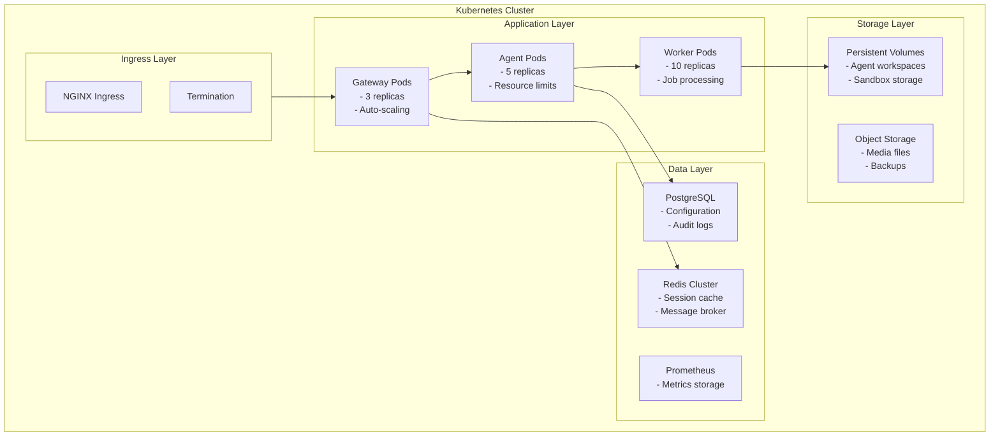

### 9.2 Infrastructure as Code

#### Terraform Module Structure

```hcl
# modules/gateway/main.tf
resource "kubernetes_deployment" "gateway" {
  metadata {
    name = "openclaw-gateway"
  }
  
  spec {
    replicas = var.gateway_replicas
    
    selector {
      match_labels = {
        app = "openclaw-gateway"
      }
    }
    
    template {
      metadata {
        labels = {
          app = "openclaw-gateway"
        }
      }
      
      spec {
        container {
          name = "gateway"
          image = "openclaw/gateway:${var.version}"
          
          resources {
            limits = {
              cpu    = "500m"
              memory = "512Mi"
            }
            requests = {
              cpu    = "250m"
              memory = "256Mi"
            }
          }
          
          env {
            name  = "REDIS_URL"
            value = var.redis_url
          }
          
          port {
            container_port = 8080
          }
        }
      }
    }
  }
}
```

---

## 10. FUTURE-PROOFING & EVOLUTION

### 10.1 Architecture Evolution Strategy

```mermaid
timeline
    title Architecture Evolution Roadmap
    
    section Phase 1: Foundation
        Core Architecture : Multi-layer design<br/>Plugin system<br/>Basic security
        : Q1 2024
    
    section Phase 2: Intelligence
        Self-Governance : Policy engine<br/>Adaptive behavior<br/>Learning system
        : Q2 2024
    
    section Phase 3: Scale
        Distributed Systems : Microservices<br/>Event streaming<br/>Global deployment
        : Q3 2024
    
    section Phase 4: AI-Native
        Advanced AI : Multi-agent systems<br/>Collective intelligence<br/>Autonomous operations
        : Q4 2024
```

### 10.2 Technology Radar

| Technology | Adoption | Status | Rationale |
|------------|----------|--------|-----------|
| **Rust for Core Components** | Adopt | Trial | Performance, safety, memory management |
| **WebAssembly for Tools** | Assess | Research | Portability, sandboxing, performance |
| **GraphQL API** | Adopt | Trial | Type safety, efficient queries |
| **Event Sourcing** | Adopt | Trial | Audit trails, temporal queries |
| **Distributed Tracing** | Adopt | Trial | Observability, debugging |
| **Machine Learning Ops** | Assess | Research | Model lifecycle, performance |

---

## 11. IMPLEMENTATION CHECKLISTS

### 11.1 Architecture Review Checklist

#### Security Review
- [ ] Input validation implemented for all external inputs
- [ ] Authentication and authorization properly configured
- [ ] Secrets management in place (no hardcoded credentials)
- [ ] Security scanning integrated in CI/CD
- [ ] Rate limiting and DoS protection configured
- [ ] Audit logging enabled for sensitive operations
- [ ] Network security groups properly configured
- [ ] Container security best practices followed

#### Performance Review
- [ ] Resource limits configured for all components
- [ ] Caching strategy implemented where appropriate
- [ ] Database queries optimized and indexed
- [ ] Connection pooling configured
- [ ] Async patterns used for I/O operations
- [ ] Memory leaks identified and fixed
- [ ] Load testing performed and results documented
- [ ] Monitoring and alerting configured

#### Reliability Review
- [ ] Circuit breakers implemented for external dependencies
- [ ] Retry logic with exponential backoff
- [ ] Health checks implemented for all services
- [ ] Graceful shutdown handling
- [ ] Backup and recovery procedures documented
- [ ] Disaster recovery plan tested
- [ ] High availability configuration validated
- [ ] Error handling and logging comprehensive

### 11.2 Code Quality Checklist

#### Design Principles
- [ ] SOLID principles followed
- [ ] Dependency inversion implemented
- [ ] Single responsibility respected
- [ ] Interface segregation applied
- [ ] Open/closed principle maintained

#### Code Standards
- [ ] Consistent naming conventions
- [ ] Proper error handling
- [ ] Comprehensive test coverage
- [ ] Documentation updated
- [ ] Code reviewed by peers
- [ ] Static analysis passed
- [ ] Security vulnerabilities addressed
- [ ] Performance benchmarks met

---

## 12. CONCLUSION & EXPERT RECOMMENDATIONS

### 12.1 Key Success Factors

1. **Start Simple, Evolve Complexity**
   - Begin with core functionality
   - Add complexity incrementally
   - Maintain architectural consistency

2. **Security by Design**
   - Implement security from day one
   - Regular security reviews
   - Stay updated on threats

3. **Observability First**
   - Build monitoring into the architecture
   - Make systems observable by default
   - Use data-driven decisions

4. **Community & Ecosystem**
   - Build extensible plugin systems
   - Foster developer community
   - Share patterns and learnings

### 12.2 Expert Recommendations

#### For Architects
- **Think in Patterns**: Identify and apply proven architectural patterns
- **Design for Failure**: Assume components will fail and plan for it
- **Measure Everything**: You can't improve what you don't measure
- **Document Decisions**: Record architectural decisions and rationale

#### For Developers
- **Write Clean Code**: Follow SOLID principles and best practices
- **Test Thoroughly**: Invest in comprehensive testing strategies
- **Security Mindset**: Always consider security implications
- **Continuous Learning**: Stay updated with new technologies and patterns

#### For Organizations
- **Invest in Tooling**: Provide proper development and monitoring tools
- **Culture of Quality**: Promote engineering excellence
- **Long-term Thinking**: Balance short-term delivery with long-term maintainability
- **Knowledge Sharing**: Create and maintain architectural documentation

---

## 13. REFERENCE IMPLEMENTATIONS

### 13.1 Starter Template Structure

```
agentic-ai-starter/
├── src/
│   ├── agents/           # Agent runtime and tools
│   ├── channels/         # Channel adapters
│   ├── gateway/          # Gateway server
│   ├── security/         # Security framework
│   ├── monitoring/       # Observability
│   └── config/           # Configuration management
├── plugins/              # Extension plugins
├── tests/                # Test suites
├── docs/                 # Documentation
├── deployments/          # Infrastructure as code
└── examples/             # Usage examples
```

### 13.2 Quick Start Commands

```bash
# Initialize project
npm init agentic-ai my-project

# Add channel plugin
npm install @agentic-ai/channel-discord

# Add security plugin
npm install @agentic-ai/security-advanced

# Deploy to production
npm run deploy:prod

# Run tests
npm test

# Security scan
npm run security:scan
```

---

This reference architecture provides a comprehensive foundation for building sustainable, self-governed agentic AI systems. It combines proven architectural patterns with modern security practices and scalability considerations, making it suitable for both small projects and enterprise-scale deployments.

The architecture emphasizes modularity, security, and observability while maintaining flexibility for future evolution and adaptation to new technologies and requirements.
