# Reference Architecture Template for Agentic AI Systems
## Production-Ready Patterns & Frameworks Based on OpenClaw Analysis

---

## 🎯 EXECUTIVE SUMMARY

This reference architecture provides a **comprehensive blueprint** for building enterprise-grade agentic AI systems. Based on deep analysis of OpenClaw's production architecture, it offers **proven patterns**, **security frameworks**, and **scalability strategies** that can be adapted for any AI agent project.

### Key Benefits
- 🏗️ **Production-Ready**: Battle-tested patterns from real-world deployment
- 🔒 **Security-First**: Multi-layer security with zero-trust principles
- 📈 **Scalable**: Horizontal and vertical scaling patterns
- 🔧 **Extensible**: Plugin-based architecture for customization
- 📊 **Observable**: Built-in monitoring and observability

---

## 📋 REFERENCE ARCHITECTURE OVERVIEW

### Core System Layers

> 💡 **Expert Tip**: Layer separation is crucial for maintainability. Each layer should have a single responsibility and communicate only with adjacent layers. This prevents tight coupling and makes testing easier.

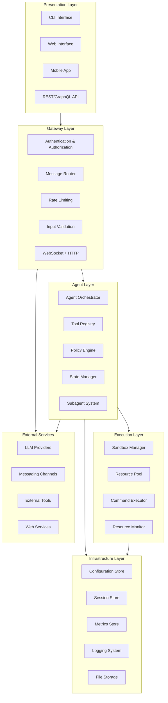
```mermaid
flowchart TB
    subgraph Presentation["Presentation Layer"]
        CLI[CLI Interface]
        WebUI[Web Interface]
        Mobile[Mobile App]
        API[REST/GraphQL API]
    end

    subgraph Gateway["Gateway Layer"]
        Auth[Authentication & Authorization]
        Routing[Message Router]
        RateLimit[Rate Limiting]
        Validation[Input Validation]
        Protocol[WebSocket + HTTP]
    end

    subgraph Agent["Agent Layer"]
        Orchestrator[Agent Orchestrator]
        ToolRegistry[Tool Registry]
        PolicyEngine[Policy Engine]
        StateManager[State Manager]
        Subagents[Subagent System]
    end

    subgraph Execution["Execution Layer"]
        Sandbox[Sandbox Manager]
        ResourcePool[Resource Pool]
        Executor[Command Executor]
        Monitor[Resource Monitor]
    end

    subgraph Infrastructure["Infrastructure Layer"]
        Config[Configuration Store]
        Session[Session Store]
        Metrics[Metrics Store]
        Logging[Logging System]
        Storage[File Storage]
    end

    subgraph External["External Services"]
        LLM[LLM Providers]
        Channels[Messaging Channels]
        Tools[External Tools]
        Services[Web Services]
    end

    Presentation --> Gateway
    Gateway --> Agent
    Agent --> Execution
    Agent --> Infrastructure
    Execution --> Infrastructure
    Gateway --> External
    Agent --> External
```

#### Layer Communication Patterns

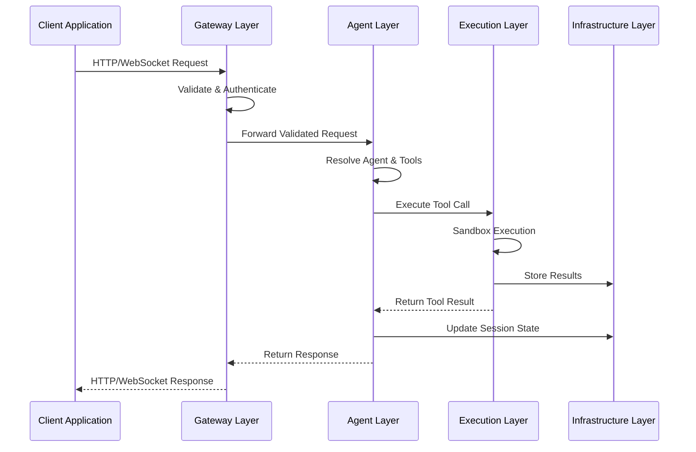
```mermaid
sequenceDiagram
    participant Client as Client Application
    participant Gateway as Gateway Layer
    participant Agent as Agent Layer
    participant Exec as Execution Layer
    participant Infra as Infrastructure Layer
    
    Client->>Gateway: HTTP/WebSocket Request
    Gateway->>Gateway: Validate & Authenticate
    Gateway->>Agent: Forward Validated Request
    Agent->>Agent: Resolve Agent & Tools
    Agent->>Exec: Execute Tool Call
    Exec->>Exec: Sandbox Execution
    Exec->>Infra: Store Results
    Exec-->>Agent: Return Tool Result
    Agent->>Infra: Update Session State
    Agent-->>Gateway: Return Response
    Gateway-->>Client: HTTP/WebSocket Response
```

> ⚠️ **Critical Warning**: Never bypass the gateway layer for direct agent access. All requests must go through authentication, validation, and rate limiting to maintain security boundaries.

---

## 🏗️ ARCHITECTURAL PATTERNS CATALOG

### 1. Multi-Layer Security Pattern

> 🛡️ **Security Expert Insight**: Defense in depth is not just about multiple layers, but about *different types* of defenses at each layer. Combine authentication, authorization, validation, and monitoring for comprehensive protection.

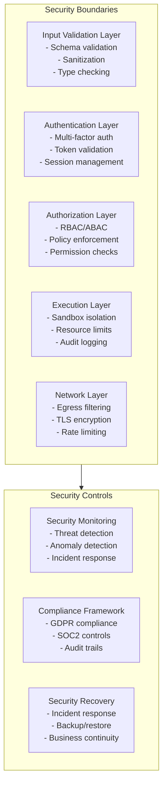
```mermaid
flowchart TD
    subgraph SecurityLayers["Security Boundaries"]
        InputLayer[Input Validation Layer<br/>- Schema validation<br/>- Sanitization<br/>- Type checking]
        AuthLayer[Authentication Layer<br/>- Multi-factor auth<br/>- Token validation<br/>- Session management]
        AuthzLayer[Authorization Layer<br/>- RBAC/ABAC<br/>- Policy enforcement<br/>- Permission checks]
        ExecLayer[Execution Layer<br/>- Sandbox isolation<br/>- Resource limits<br/>- Audit logging]
        NetworkLayer[Network Layer<br/>- Egress filtering<br/>- TLS encryption<br/>- Rate limiting]
    end

    subgraph SecurityControls["Security Controls"]
        Monitoring[Security Monitoring<br/>- Threat detection<br/>- Anomaly detection<br/>- Incident response]
        Compliance[Compliance Framework<br/>- GDPR compliance<br/>- SOC2 controls<br/>- Audit trails]
        Recovery[Security Recovery<br/>- Incident response<br/>- Backup/restore<br/>- Business continuity]
    end

    SecurityLayers --> SecurityControls
```

#### Security Flow Sequence

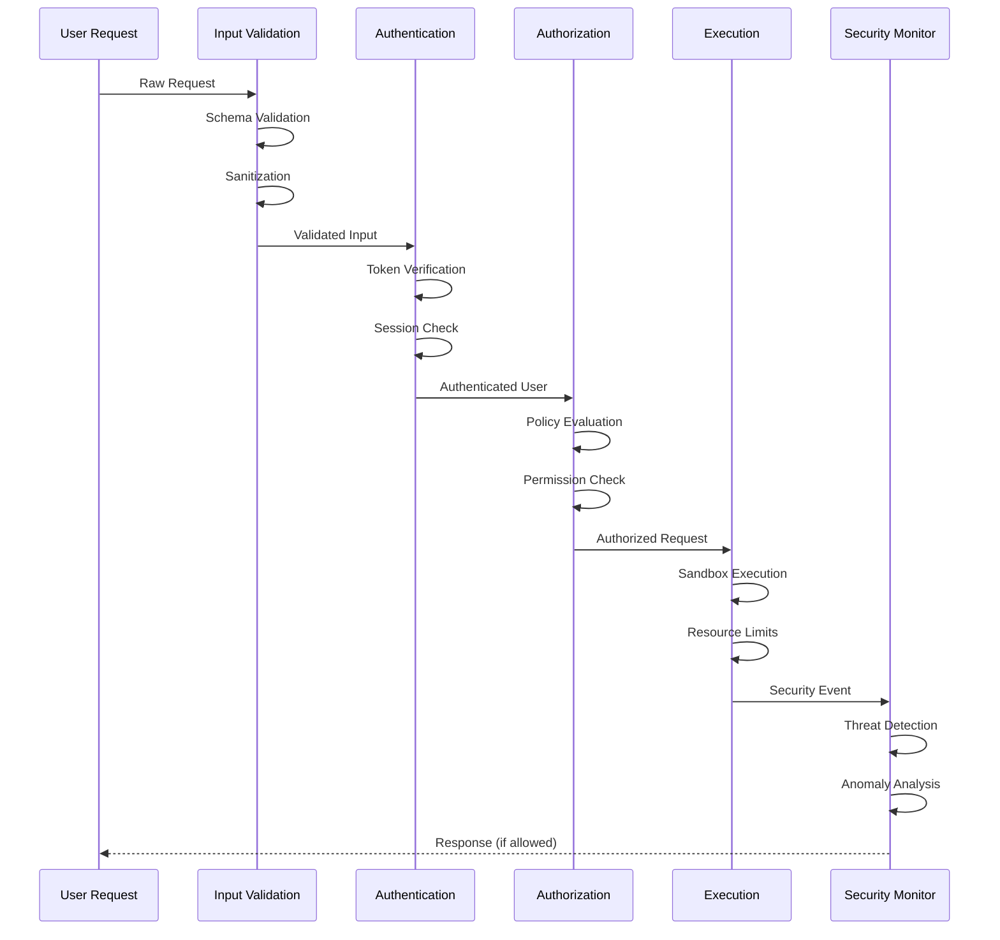
```mermaid
sequenceDiagram
    participant User as User Request
    participant Input as Input Validation
    participant Auth as Authentication
    participant Authz as Authorization
    participant Exec as Execution
    participant Monitor as Security Monitor
    
    User->>Input: Raw Request
    Input->>Input: Schema Validation
    Input->>Input: Sanitization
    Input->>Auth: Validated Input
    
    Auth->>Auth: Token Verification
    Auth->>Auth: Session Check
    Auth->>Authz: Authenticated User
    
    Authz->>Authz: Policy Evaluation
    Authz->>Authz: Permission Check
    Authz->>Exec: Authorized Request
    
    Exec->>Exec: Sandbox Execution
    Exec->>Exec: Resource Limits
    Exec->>Monitor: Security Event
    
    Monitor->>Monitor: Threat Detection
    Monitor->>Monitor: Anomaly Analysis
    Monitor-->>User: Response (if allowed)
```

**Implementation Guidelines:**
- ✅ Apply validation at every boundary
- ✅ Use principle of least privilege
- ✅ Implement defense in depth
- ✅ Log all security-relevant events
- ❌ Never trust client-side validation
- ❌ Avoid hardcoded credentials
- ❌ Don't skip security for "internal" services

### 2. Plugin-Based Channel System

> 🔌 **Architecture Insight**: The plugin pattern enables extensibility without modifying core code. Use dependency injection and interfaces to maintain loose coupling between plugins and the system.

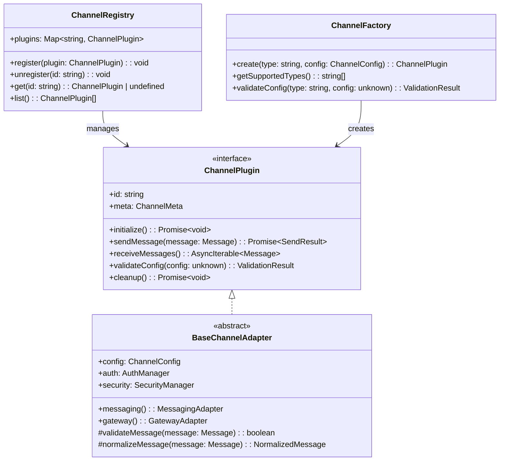
```mermaid
classDiagram
    class ChannelPlugin {
        <<interface>>
        +id: string
        +meta: ChannelMeta
        +initialize(): Promise~void~
        +sendMessage(message: Message): Promise~SendResult~
        +receiveMessages(): AsyncIterable~Message~
        +validateConfig(config: unknown): ValidationResult
        +cleanup(): Promise~void~
    }

    class BaseChannelAdapter {
        <<abstract>>
        +config: ChannelConfig
        +auth: AuthManager
        +security: SecurityManager
        +messaging(): MessagingAdapter
        +gateway(): GatewayAdapter
        #validateMessage(message: Message): boolean
        #normalizeMessage(message: Message): NormalizedMessage
    }

    class ChannelRegistry {
        +plugins: Map~string, ChannelPlugin~
        +register(plugin: ChannelPlugin): void
        +unregister(id: string): void
        +get(id: string): ChannelPlugin | undefined
        +list(): ChannelPlugin[]
    }

    class ChannelFactory {
        +create(type: string, config: ChannelConfig): ChannelPlugin
        +getSupportedTypes(): string[]
        +validateConfig(type: string, config: unknown): ValidationResult
    }

    ChannelPlugin <|.. BaseChannelAdapter
    ChannelRegistry --> ChannelPlugin : manages
    ChannelFactory --> ChannelPlugin : creates
```

#### Plugin Lifecycle Sequence

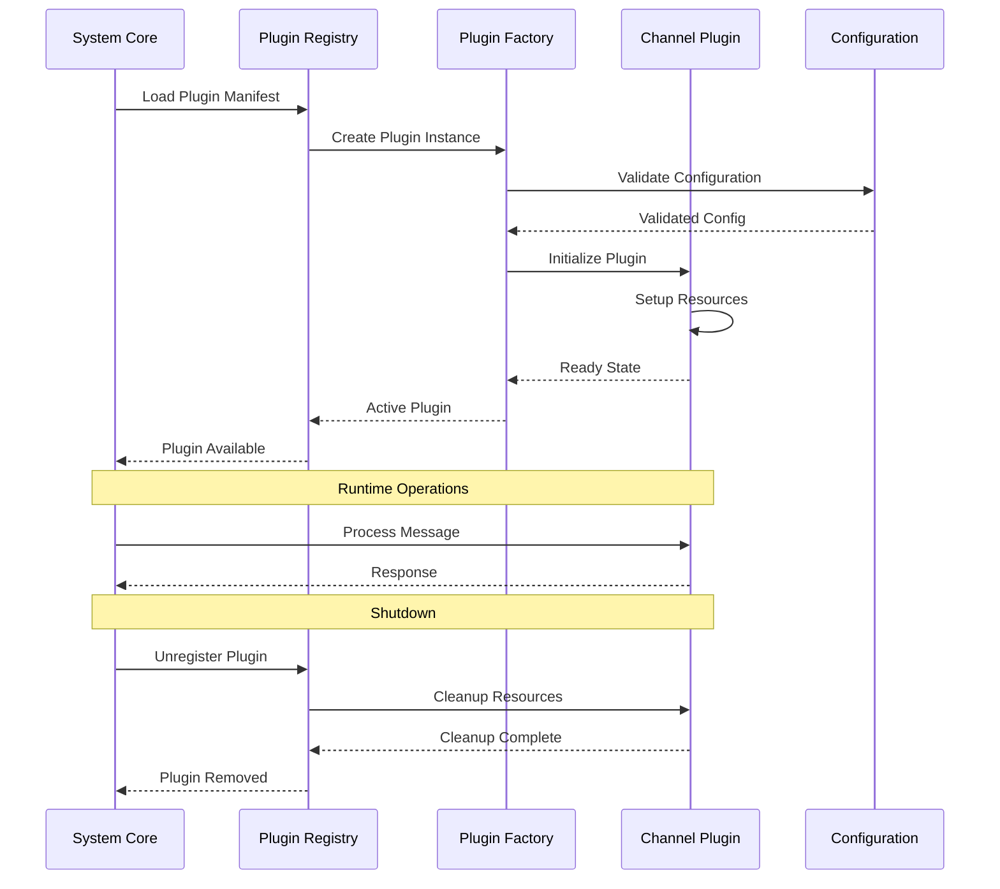
```mermaid
sequenceDiagram
    participant System as System Core
    participant Registry as Plugin Registry
    participant Factory as Plugin Factory
    participant Plugin as Channel Plugin
    participant Config as Configuration
    
    System->>Registry: Load Plugin Manifest
    Registry->>Factory: Create Plugin Instance
    Factory->>Config: Validate Configuration
    Config-->>Factory: Validated Config
    Factory->>Plugin: Initialize Plugin
    Plugin->>Plugin: Setup Resources
    Plugin-->>Factory: Ready State
    Factory-->>Registry: Active Plugin
    Registry-->>System: Plugin Available
    
    Note over System,Plugin: Runtime Operations
    System->>Plugin: Process Message
    Plugin-->>System: Response
    
    Note over System,Plugin: Shutdown
    System->>Registry: Unregister Plugin
    Registry->>Plugin: Cleanup Resources
    Plugin-->>Registry: Cleanup Complete
    Registry-->>System: Plugin Removed
```

**Key Benefits:**
- ✅ Extensible channel support
- ✅ Consistent interface across platforms
- ✅ Easy testing and mocking
- ✅ Hot-swappable implementations
- ✅ Isolated plugin failures
- ✅ Version compatibility management

> ⚠️ **Critical Warning**: Always run plugins in isolated environments. A malicious plugin should never be able to access core system resources or other plugins' data.

### 3. Lane-Based Concurrency Pattern

> 🚀 **Performance Insight**: Lane-based concurrency prevents resource contention and enables predictable performance. Each lane operates independently with its own resource pool and scheduling.

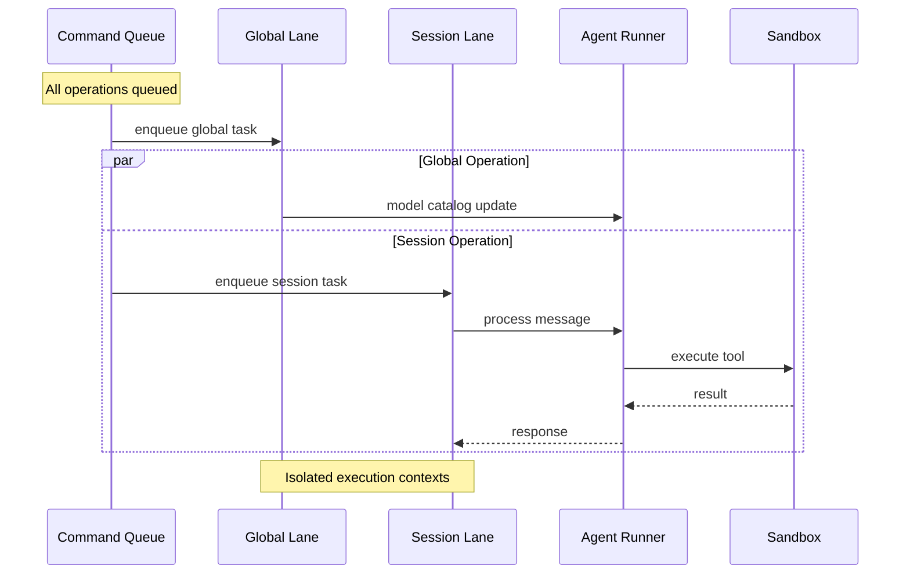
```mermaid
sequenceDiagram
    participant Queue as Command Queue
    participant GlobalLane as Global Lane
    participant SessionLane as Session Lane
    participant Agent as Agent Runner
    participant Sandbox as Sandbox

    Note over Queue: All operations queued
    Queue->>GlobalLane: enqueue global task
    
    par Global Operation
        GlobalLane->>Agent: model catalog update
    and Session Operation
        Queue->>SessionLane: enqueue session task
        SessionLane->>Agent: process message
        Agent->>Sandbox: execute tool
        Sandbox-->>Agent: result
        Agent-->>SessionLane: response
    end
    
    Note over GlobalLane,SessionLane: Isolated execution contexts
```

#### Lane Architecture Deep Dive

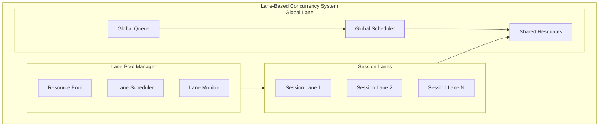
```mermaid
flowchart TB
    subgraph LaneSystem["Lane-Based Concurrency System"]
        subgraph GlobalLane["Global Lane"]
            GL_Queue[Global Queue]
            GL_Scheduler[Global Scheduler]
            GL_Resources[Shared Resources]
        end
        
        subgraph SessionLanes["Session Lanes"]
            SL1[Session Lane 1]
            SL2[Session Lane 2]
            SLN[Session Lane N]
        end
        
        subgraph LanePool["Lane Pool Manager"]
            Pool[Resource Pool]
            Scheduler[Lane Scheduler]
            Monitor[Lane Monitor]
        end
    end
    
    GL_Queue --> GL_Scheduler
    GL_Scheduler --> GL_Resources
    LanePool --> SessionLanes
    SessionLanes --> GL_Resources
```

**Implementation Benefits:**
- ✅ Prevents race conditions
- ✅ Enables resource isolation
- ✅ Simplifies debugging
- ✅ Supports graceful degradation
- ✅ Predictable performance
- ✅ Easy to scale horizontally

> 💡 **Expert Tip**: Use separate resource pools for each lane type. Global lanes can share resources, while session lanes should have dedicated pools to prevent noisy neighbor problems.

---

## 🔧 COMPONENT ARCHITECTURE PATTERNS

### 1. Agent Runner Pattern

> 🤖 **Agent Architecture Insight**: The agent runner should be stateless where possible, with state managed externally. This enables horizontal scaling and fault tolerance.

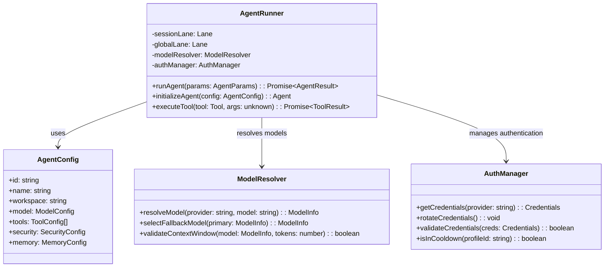
```mermaid
classDiagram
    class AgentRunner {
        +runAgent(params: AgentParams): Promise~AgentResult~
        +initializeAgent(config: AgentConfig): Agent
        +executeTool(tool: Tool, args: unknown): Promise~ToolResult~
        -sessionLane: Lane
        -globalLane: Lane
        -modelResolver: ModelResolver
        -authManager: AuthManager
    }

    class AgentConfig {
        +id: string
        +name: string
        +workspace: string
        +model: ModelConfig
        +tools: ToolConfig[]
        +security: SecurityConfig
        +memory: MemoryConfig
    }

    class ModelResolver {
        +resolveModel(provider: string, model: string): ModelInfo
        +selectFallbackModel(primary: ModelInfo): ModelInfo
        +validateContextWindow(model: ModelInfo, tokens: number): boolean
    }

    class AuthManager {
        +getCredentials(provider: string): Credentials
        +rotateCredentials(): void
        +validateCredentials(creds: Credentials): boolean
        +isInCooldown(profileId: string): boolean
    }

    AgentRunner --> AgentConfig : uses
    AgentRunner --> ModelResolver : resolves models
    AgentRunner --> AuthManager : manages authentication
```

#### Agent Execution Sequence

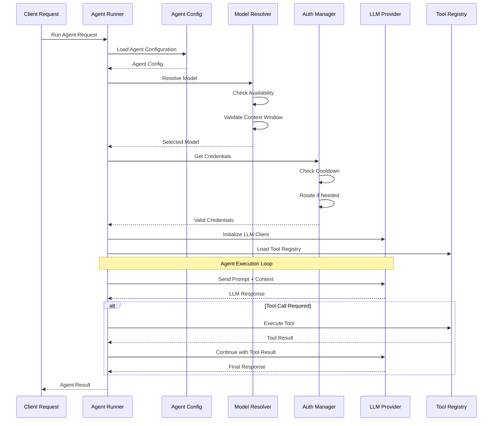
```mermaid
sequenceDiagram
    participant Client as Client Request
    participant Runner as Agent Runner
    participant Config as Agent Config
    participant Model as Model Resolver
    participant Auth as Auth Manager
    participant LLM as LLM Provider
    participant Tools as Tool Registry
    
    Client->>Runner: Run Agent Request
    Runner->>Config: Load Agent Configuration
    Config-->>Runner: Agent Config
    
    Runner->>Model: Resolve Model
    Model->>Model: Check Availability
    Model->>Model: Validate Context Window
    Model-->>Runner: Selected Model
    
    Runner->>Auth: Get Credentials
    Auth->>Auth: Check Cooldown
    Auth->>Auth: Rotate if Needed
    Auth-->>Runner: Valid Credentials
    
    Runner->>LLM: Initialize LLM Client
    Runner->>Tools: Load Tool Registry
    
    Note over Runner,LLM: Agent Execution Loop
    Runner->>LLM: Send Prompt + Context
    LLM-->>Runner: LLM Response
    
    alt Tool Call Required
        Runner->>Tools: Execute Tool
        Tools-->>Runner: Tool Result
        Runner->>LLM: Continue with Tool Result
        LLM-->>Runner: Final Response
    end
    
    Runner-->>Client: Agent Result
```

> ⚠️ **Critical Warning**: Always validate tool parameters before execution. Never trust LLM-generated input directly - use schema validation and sanitization.

### 2. Tool System Pattern

> 🛠️ **Tool System Insight**: Tools should be atomic, stateless, and idempotent where possible. This makes them predictable, testable, and safe to retry.

```mermaid
classDiagram
    class Tool {
        <<interface>>
        +name: string
        +description: string
        +parameters: Schema
        +execute(args: unknown): Promise~ToolResult~
    }

    class ToolRegistry {
        +tools: Map~string, Tool~
        +policies: ToolPolicy
        +register(tool: Tool): void
        +execute(name: string, args: unknown): Promise~ToolResult~
        -checkPolicy(tool: Tool, context: Context): PolicyDecision
    }

    class ToolPolicy {
        +allow: string[]
        +deny: string[]
        +elevated: string[]
        +check(toolName: string, context: Context): PolicyDecision
    }

    class SandboxExecutor {
        +executeInSandbox(tool: Tool, args: unknown): Promise~ToolResult~
        +createSandbox(config: SandboxConfig): Sandbox
        +cleanupSandbox(sandboxId: string): void
    }

    Tool <|.. BashTool
    Tool <|.. FileTool
    Tool <|~~ NetworkTool
    ToolRegistry --> Tool : manages
    ToolRegistry --> ToolPolicy : enforces
    ToolRegistry --> SandboxExecutor : executes
```

#### Tool Execution Sequence

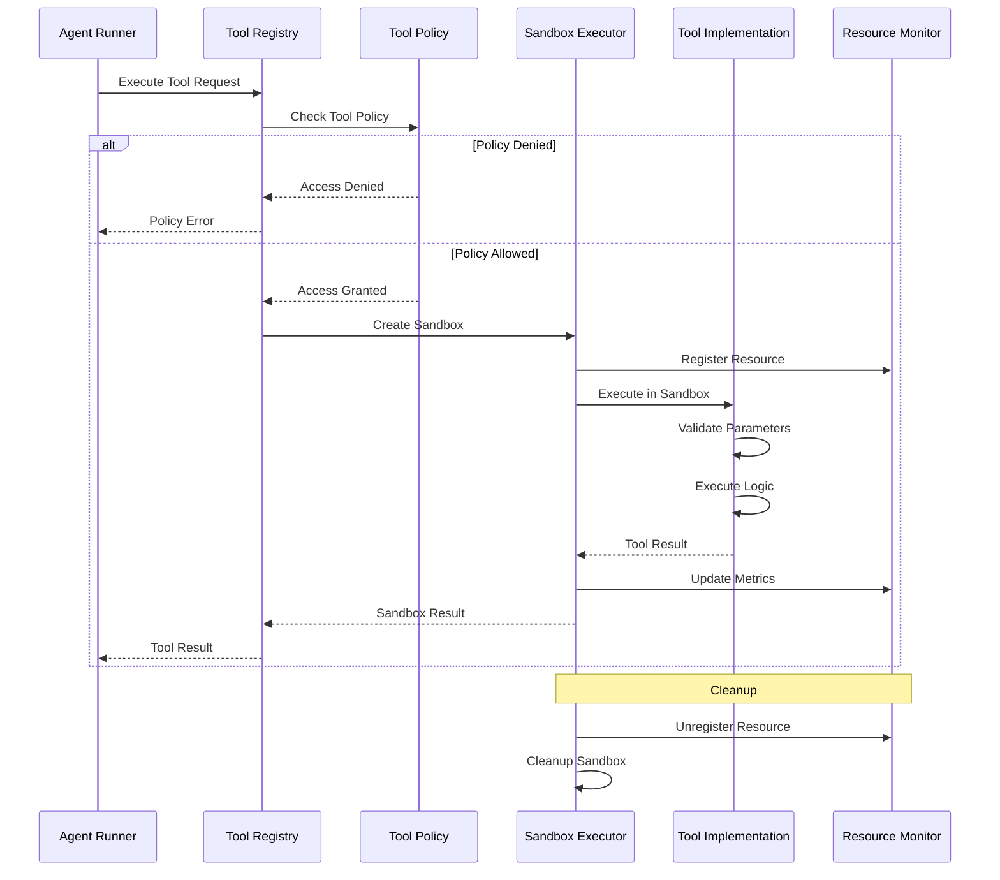
```mermaid
sequenceDiagram
    participant Agent as Agent Runner
    participant Registry as Tool Registry
    participant Policy as Tool Policy
    participant Sandbox as Sandbox Executor
    participant Tool as Tool Implementation
    participant Monitor as Resource Monitor
    
    Agent->>Registry: Execute Tool Request
    Registry->>Policy: Check Tool Policy
    
    alt Policy Denied
        Policy-->>Registry: Access Denied
        Registry-->>Agent: Policy Error
    else Policy Allowed
        Policy-->>Registry: Access Granted
        Registry->>Sandbox: Create Sandbox
        Sandbox->>Monitor: Register Resource
        
        Sandbox->>Tool: Execute in Sandbox
        Tool->>Tool: Validate Parameters
        Tool->>Tool: Execute Logic
        Tool-->>Sandbox: Tool Result
        
        Sandbox->>Monitor: Update Metrics
        Sandbox-->>Registry: Sandbox Result
        Registry-->>Agent: Tool Result
    end
    
    Note over Sandbox,Monitor: Cleanup
    Sandbox->>Monitor: Unregister Resource
    Sandbox->>Sandbox: Cleanup Sandbox
```

> 💡 **Expert Tip**: Implement tool timeouts and resource limits. A misbehaving tool should never be able to hang the entire system or consume unlimited resources.

### 3. Session Management Pattern

> 💾 **Session Management Insight**: Sessions should be immutable where possible. Instead of modifying session data, create new versions. This enables audit trails and rollback capabilities.

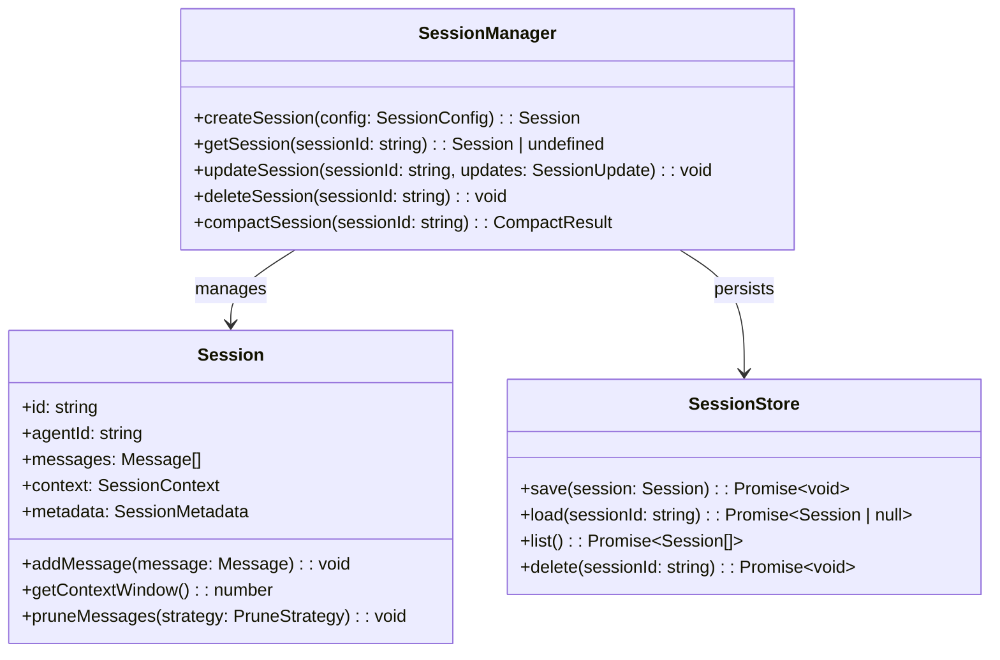
```mermaid
classDiagram
    class SessionManager {
        +createSession(config: SessionConfig): Session
        +getSession(sessionId: string): Session | undefined
        +updateSession(sessionId: string, updates: SessionUpdate): void
        +deleteSession(sessionId: string): void
        +compactSession(sessionId: string): CompactResult
    }

    class Session {
        +id: string
        +agentId: string
        +messages: Message[]
        +context: SessionContext
        +metadata: SessionMetadata
        +addMessage(message: Message): void
        +getContextWindow(): number
        +pruneMessages(strategy: PruneStrategy): void
    }

    class SessionStore {
        +save(session: Session): Promise~void~
        +load(sessionId: string): Promise~Session | null~
        +list(): Promise~Session[]~
        +delete(sessionId: string): Promise~void~
    }

    SessionManager --> Session : manages
    SessionManager --> SessionStore : persists
```

#### Session Lifecycle Sequence

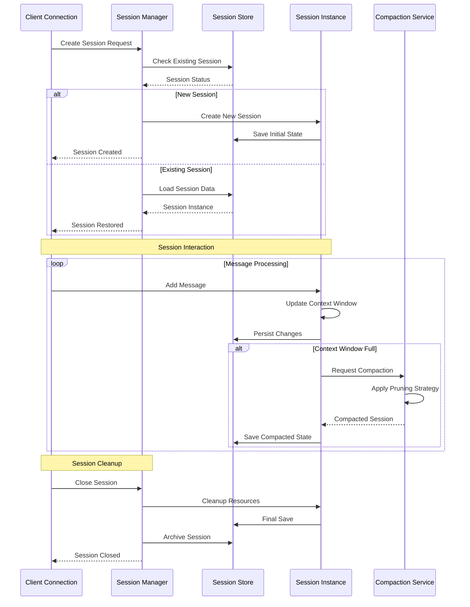
```mermaid
sequenceDiagram
    participant Client as Client Connection
    participant Manager as Session Manager
    participant Store as Session Store
    participant Session as Session Instance
    participant Compact as Compaction Service
    
    Client->>Manager: Create Session Request
    Manager->>Store: Check Existing Session
    Store-->>Manager: Session Status
    
    alt New Session
        Manager->>Session: Create New Session
        Session->>Store: Save Initial State
        Manager-->>Client: Session Created
    else Existing Session
        Manager->>Store: Load Session Data
        Store-->>Manager: Session Instance
        Manager-->>Client: Session Restored
    end
    
    Note over Client,Session: Session Interaction
    loop Message Processing
        Client->>Session: Add Message
        Session->>Session: Update Context Window
        Session->>Store: Persist Changes
        
        alt Context Window Full
            Session->>Compact: Request Compaction
            Compact->>Compact: Apply Pruning Strategy
            Compact-->>Session: Compacted Session
            Session->>Store: Save Compacted State
        end
    end
    
    Note over Client,Manager: Session Cleanup
    Client->>Manager: Close Session
    Manager->>Session: Cleanup Resources
    Session->>Store: Final Save
    Manager->>Store: Archive Session
    Manager-->>Client: Session Closed
```

> ⚠️ **Critical Warning**: Implement session size limits and automatic cleanup. Unbounded session growth can lead to memory exhaustion and performance degradation.

---

## 🛡️ SECURITY FRAMEWORK

### 1. Zero Trust Security Model

> 🔐 **Zero Trust Principle**: Never trust, always verify. Every request, regardless of source, must be authenticated and authorized. Trust is a continuous process, not a one-time decision.

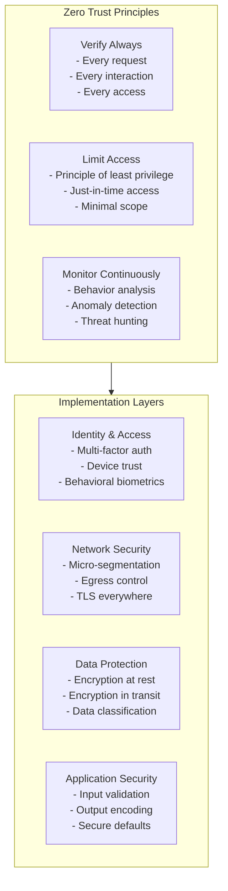
```mermaid
flowchart TB
    subgraph ZeroTrust["Zero Trust Principles"]
        Verify[Verify Always<br/>- Every request<br/>- Every interaction<br/>- Every access]
        Limit[Limit Access<br/>- Principle of least privilege<br/>- Just-in-time access<br/>- Minimal scope]
        Monitor[Monitor Continuously<br/>- Behavior analysis<br/>- Anomaly detection<br/>- Threat hunting]
    end

    subgraph Implementation["Implementation Layers"]
        Identity[Identity & Access<br/>- Multi-factor auth<br/>- Device trust<br/>- Behavioral biometrics]
        Network[Network Security<br/>- Micro-segmentation<br/>- Egress control<br/>- TLS everywhere]
        Data[Data Protection<br/>- Encryption at rest<br/>- Encryption in transit<br/>- Data classification]
        Application[Application Security<br/>- Input validation<br/>- Output encoding<br/>- Secure defaults]
    end

    ZeroTrust --> Implementation
```

#### Zero Trust Authentication Flow

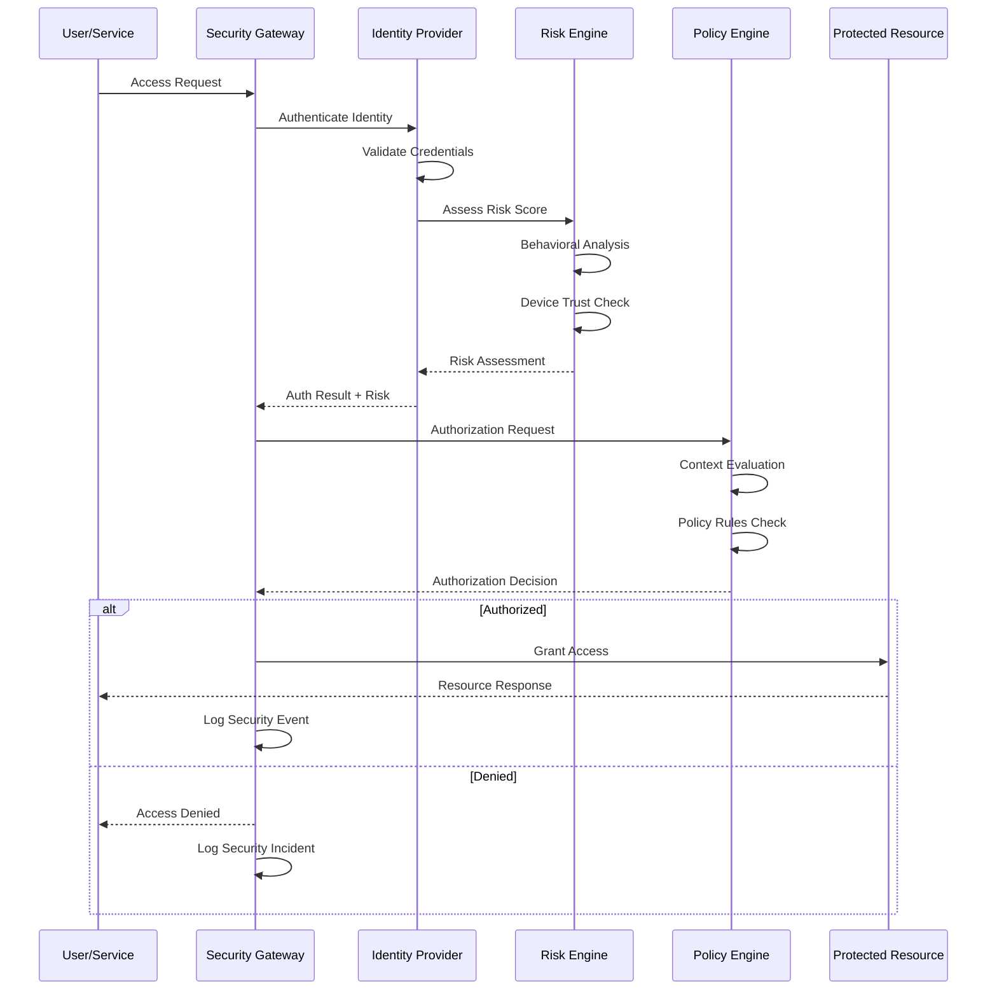
```mermaid
sequenceDiagram
    participant User as User/Service
    participant Gateway as Security Gateway
    participant Identity as Identity Provider
    participant Risk as Risk Engine
    participant Policy as Policy Engine
    participant Resource as Protected Resource
    
    User->>Gateway: Access Request
    Gateway->>Identity: Authenticate Identity
    Identity->>Identity: Validate Credentials
    Identity->>Risk: Assess Risk Score
    Risk->>Risk: Behavioral Analysis
    Risk->>Risk: Device Trust Check
    Risk-->>Identity: Risk Assessment
    Identity-->>Gateway: Auth Result + Risk
    
    Gateway->>Policy: Authorization Request
    Policy->>Policy: Context Evaluation
    Policy->>Policy: Policy Rules Check
    Policy-->>Gateway: Authorization Decision
    
    alt Authorized
        Gateway->>Resource: Grant Access
        Resource-->>User: Resource Response
        Gateway->>Gateway: Log Security Event
    else Denied
        Gateway-->>User: Access Denied
        Gateway->>Gateway: Log Security Incident
    end
```

> 💡 **Expert Tip**: Implement adaptive authentication. Use risk-based authentication to require additional verification for high-risk operations or unusual behavior patterns.

### 2. Security Controls Implementation

> 🛡️ **Security Implementation Insight**: Security controls should be defense-in-depth, with multiple independent controls protecting each asset. Failure of one control should not compromise security.

#### Input Validation Framework

```typescript
interface ValidationSchema {
  type: 'object' | 'string' | 'number' | 'array';
  properties?: Record<string, ValidationSchema>;
  required?: string[];
  pattern?: string;
  minimum?: number;
  maximum?: number;
  minLength?: number;
  maxLength?: number;
  enum?: any[];
  format?: 'email' | 'uri' | 'uuid' | 'datetime';
  custom?: (value: any) => boolean | string;
}

class InputValidator {
  private schemas = new Map<string, ValidationSchema>();
  private sanitizer = new InputSanitizer();
  
  validate(input: unknown, schemaName: string): ValidationResult {
    const schema = this.schemas.get(schemaName);
    if (!schema) {
      throw new Error(`Schema not found: ${schemaName}`);
    }
    
    // Sanitize first, then validate
    const sanitized = this.sanitizer.sanitize(input, schema);
    return this.validateWithSchema(sanitized, schema);
  }
  
  private validateWithSchema(input: unknown, schema: ValidationSchema): ValidationResult {
    const errors: string[] = [];
    
    // Type validation
    if (!this.validateType(input, schema.type)) {
      errors.push(`Expected type ${schema.type}, got ${typeof input}`);
      return { valid: false, errors, data: null };
    }
    
    // Pattern validation
    if (schema.pattern && typeof input === 'string') {
      const regex = new RegExp(schema.pattern);
      if (!regex.test(input)) {
        errors.push(`Input does not match required pattern`);
      }
    }
    
    // Range validation
    if (typeof input === 'number') {
      if (schema.minimum !== undefined && input < schema.minimum) {
        errors.push(`Value must be >= ${schema.minimum}`);
      }
      if (schema.maximum !== undefined && input > schema.maximum) {
        errors.push(`Value must be <= ${schema.maximum}`);
      }
    }
    
    // Length validation
    if (typeof input === 'string') {
      if (schema.minLength !== undefined && input.length < schema.minLength) {
        errors.push(`Length must be >= ${schema.minLength}`);
      }
      if (schema.maxLength !== undefined && input.length > schema.maxLength) {
        errors.push(`Length must be <= ${schema.maxLength}`);
      }
    }
    
    // Custom validation
    if (schema.custom) {
      const customResult = schema.custom(input);
      if (customResult !== true) {
        errors.push(typeof customResult === 'string' ? customResult : 'Custom validation failed');
      }
    }
    
    return {
      valid: errors.length === 0,
      errors,
      data: errors.length === 0 ? input : null
    };
  }
  
  private validateType(input: unknown, expectedType: string): boolean {
    switch (expectedType) {
      case 'string': return typeof input === 'string';
      case 'number': return typeof input === 'number' && !isNaN(input);
      case 'object': return typeof input === 'object' && input !== null && !Array.isArray(input);
      case 'array': return Array.isArray(input);
      default: return false;
    }
  }
}

class InputSanitizer {
  sanitize(input: unknown, schema: ValidationSchema): unknown {
    if (typeof input === 'string') {
      return this.sanitizeString(input);
    }
    if (typeof input === 'object' && input !== null) {
      return this.sanitizeObject(input as Record<string, unknown>, schema);
    }
    return input;
  }
  
  private sanitizeString(str: string): string {
    return str
      .trim()
      // Remove potential XSS
      .replace(/<script\b[^<]*(?:(?!<\/script>)<[^<]*)*<\/script>/gi, '')
      // Remove potential SQL injection patterns
      .replace(/('|(\-\-)|(;)|(\||\|)|(\*|\*))/gi, '')
      // Normalize whitespace
      .replace(/\s+/g, ' ');
  }
  
  private sanitizeObject(obj: Record<string, unknown>, schema: ValidationSchema): Record<string, unknown> {
    const sanitized: Record<string, unknown> = {};
    
    if (schema.properties) {
      for (const [key, value] of Object.entries(obj)) {
        if (schema.properties[key]) {
          sanitized[key] = this.sanitize(value, schema.properties[key]);
        }
      }
    }
    
    return sanitized;
  }
}
```

#### Authorization Framework

```typescript
interface Policy {
  id: string;
  effect: 'allow' | 'deny';
  resources: string[];
  actions: string[];
  conditions?: PolicyCondition[];
  priority: number;
}

interface PolicyCondition {
  operator: 'equals' | 'contains' | 'startsWith' | 'endsWith' | 'in' | 'notIn';
  key: string;
  value: any;
}

interface AccessRequest {
  subject: string; // User or service ID
  resource: string; // Resource being accessed
  action: string; // Action being performed
  context: Record<string, any>; // Request context (IP, time, etc.)
}

interface PolicyDecision {
  effect: 'allow' | 'deny';
  policyId: string;
  reason?: string;
}

class PolicyEngine {
  private policies: Policy[] = [];
  private cache = new Map<string, PolicyDecision>();
  private auditLogger: AuditLogger;
  
  constructor(policies: Policy[], auditLogger: AuditLogger) {
    this.policies = policies.sort((a, b) => b.priority - a.priority);
    this.auditLogger = auditLogger;
  }
  
  evaluate(request: AccessRequest): PolicyDecision {
    // Check cache first
    const cacheKey = this.getCacheKey(request);
    const cached = this.cache.get(cacheKey);
    if (cached) {
      this.auditLogger.log('policy_cache_hit', { request, decision: cached });
      return cached;
    }
    
    // Evaluate policies in priority order
    for (const policy of this.policies) {
      if (this.matches(policy, request)) {
        const decision: PolicyDecision = {
          effect: policy.effect,
          policyId: policy.id,
          reason: policy.effect === 'deny' ? 'Explicit deny policy' : 'Allowed by policy'
        };
        
        // Cache the decision
        this.cache.set(cacheKey, decision);
        
        // Log the decision
        this.auditLogger.log('policy_evaluated', { request, decision, policy });
        
        return decision;
      }
    }
    
    // Default deny
    const defaultDecision: PolicyDecision = {
      effect: 'deny',
      policyId: 'default-deny',
      reason: 'No matching policy found'
    };
    
    this.auditLogger.log('policy_default_deny', { request, decision: defaultDecision });
    return defaultDecision;
  }
  
  private matches(policy: Policy, request: AccessRequest): boolean {
    return this.matchesResource(policy, request.resource) &&
           this.matchesAction(policy, request.action) &&
           this.matchesConditions(policy, request);
  }
  
  private matchesResource(policy: Policy, resource: string): boolean {
    return policy.resources.some(pattern => this.matchesPattern(pattern, resource));
  }
  
  private matchesAction(policy: Policy, action: string): boolean {
    return policy.actions.some(pattern => this.matchesPattern(pattern, action));
  }
  
  private matchesConditions(policy: Policy, request: AccessRequest): boolean {
    if (!policy.conditions) return true;
    
    return policy.conditions.every(condition => {
      const actualValue = this.getValue(request, condition.key);
      return this.compareValues(actualValue, condition.operator, condition.value);
    });
  }
  
  private matchesPattern(pattern: string, value: string): boolean {
    if (pattern === '*') return true;
    if (pattern.includes('*')) {
      const regex = new RegExp(pattern.replace(/\*/g, '.*'));
      return regex.test(value);
    }
    return pattern === value;
  }
  
  private getValue(request: AccessRequest, key: string): any {
    if (key.startsWith('context.')) {
      return request.context[key.substring(8)];
    }
    if (key.startsWith('request.')) {
      return (request as any)[key.substring(8)];
    }
    return null;
  }
  
  private compareValues(actual: any, operator: string, expected: any): boolean {
    switch (operator) {
      case 'equals': return actual === expected;
      case 'contains': return typeof actual === 'string' && actual.includes(expected);
      case 'startsWith': return typeof actual === 'string' && actual.startsWith(expected);
      case 'endsWith': return typeof actual === 'string' && actual.endsWith(expected);
      case 'in': return Array.isArray(expected) && expected.includes(actual);
      case 'notIn': return Array.isArray(expected) && !expected.includes(actual);
      default: return false;
    }
  }
  
  private getCacheKey(request: AccessRequest): string {
    return `${request.subject}:${request.resource}:${request.action}:${JSON.stringify(request.context)}`;
  }
}

class AuditLogger {
  log(event: string, data: any): void {
    const logEntry = {
      timestamp: new Date().toISOString(),
      event,
      data,
      severity: this.getSeverity(event)
    };
    
    // Send to secure audit log
    console.log(JSON.stringify(logEntry));
    
    // In production, send to tamper-evident storage
    // this.secureLogger.write(logEntry);
  }
  
  private getSeverity(event: string): 'low' | 'medium' | 'high' | 'critical' {
    if (event.includes('deny') || event.includes('failed')) return 'high';
    if (event.includes('error')) return 'medium';
    return 'low';
  }
}
```

> ⚠️ **Critical Warning**: Always log security events to tamper-evident storage. Regular logs can be modified by attackers, but audit logs should be write-once, read-many with cryptographic verification.

---

## 📈 SCALABILITY PATTERNS

### 1. Horizontal Scaling Architecture

> 📈 **Scaling Insight**: Horizontal scaling provides better fault tolerance and resource utilization than vertical scaling. Design for statelessness where possible to enable easy scaling.

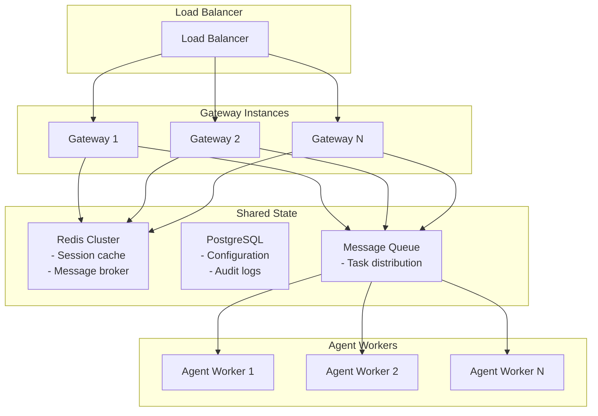
```mermaid
flowchart TB
    subgraph LB["Load Balancer"]
        LB1[Load Balancer]
    end

    subgraph Gateways["Gateway Instances"]
        GW1[Gateway 1]
        GW2[Gateway 2]
        GW3[Gateway N]
    end

    subgraph Agents["Agent Workers"]
        Agent1[Agent Worker 1]
        Agent2[Agent Worker 2]
        Agent3[Agent Worker N]
    end

    subgraph SharedState["Shared State"]
        Redis[Redis Cluster<br/>- Session cache<br/>- Message broker]
        DB[PostgreSQL<br/>- Configuration<br/>- Audit logs]
        MQ[Message Queue<br/>- Task distribution]
    end

    LB1 --> GW1
    LB1 --> GW2
    LB1 --> GW3
    
    GW1 --> Redis
    GW2 --> Redis
    GW3 --> Redis
    
    GW1 --> MQ
    GW2 --> MQ
    GW3 --> MQ
    
    MQ --> Agent1
    MQ --> Agent2
    MQ --> Agent3
```

#### Scaling Sequence Diagram

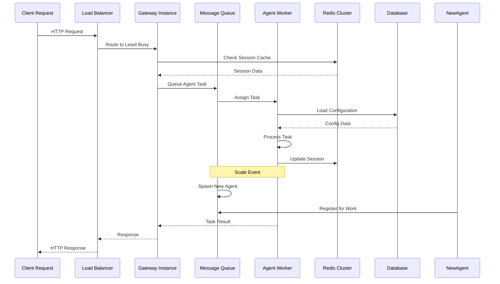
```mermaid
sequenceDiagram
    participant Client as Client Request
    participant LB as Load Balancer
    participant GW as Gateway Instance
    participant MQ as Message Queue
    participant Agent as Agent Worker
    participant Redis as Redis Cluster
    participant DB as Database
    
    Client->>LB: HTTP Request
    LB->>GW: Route to Least Busy
    
    GW->>Redis: Check Session Cache
    Redis-->>GW: Session Data
    
    GW->>MQ: Queue Agent Task
    MQ->>Agent: Assign Task
    
    Agent->>DB: Load Configuration
    DB-->>Agent: Config Data
    
    Agent->>Agent: Process Task
    Agent->>Redis: Update Session
    
    Note over Agent,MQ: Scale Event
    MQ->>MQ: Spawn New Agent
    NewAgent->>MQ: Register for Work
    
    Agent-->>GW: Task Result
    GW-->>LB: Response
    LB-->>Client: HTTP Response
```

### 2. Resource Pooling Pattern

> 🏊 **Resource Pooling Insight**: Proper resource pooling prevents resource exhaustion and improves performance. Implement different pools for different resource types with appropriate sizing.

```typescript
class ResourcePool<T> {
  private available: T[] = [];
  private inUse = new Set<T>();
  private maxCapacity: number;
  private minCapacity: number;
  private factory: () => Promise<T>;
  private destroyer?: (resource: T) => Promise<void>;
  private validator?: (resource: T) => boolean;
  private waitQueue: Array<{ resolve: (value: T) => void; reject: (error: Error) => void; timeout: NodeJS.Timeout }> = [];
  private metrics: ResourcePoolMetrics;
  
  constructor(options: ResourcePoolOptions<T>) {
    this.maxCapacity = options.maxCapacity;
    this.minCapacity = options.minCapacity || 1;
    this.factory = options.factory;
    this.destroyer = options.destroyer;
    this.validator = options.validator;
    this.metrics = new ResourcePoolMetrics();
    
    // Pre-warm the pool
    this.preWarm();
  }
  
  async acquire(timeoutMs: number = 30000): Promise<T> {
    // Return available resource
    if (this.available.length > 0) {
      const resource = this.available.pop()!;
      if (this.validateResource(resource)) {
        this.inUse.add(resource);
        this.metrics.recordAcquire();
        return resource;
      } else {
        // Resource is invalid, destroy it
        this.destroyResource(resource);
        return this.acquire(timeoutMs);
      }
    }
    
    // Create new resource if under capacity
    if (this.inUse.size < this.maxCapacity) {
      try {
        const resource = await this.factory();
        this.inUse.add(resource);
        this.metrics.recordCreate();
        this.metrics.recordAcquire();
        return resource;
      } catch (error) {
        this.metrics.recordCreateError();
        throw error;
      }
    }
    
    // Wait for resource to become available
    return this.waitForResource(timeoutMs);
  }
  
  async release(resource: T): Promise<void> {
    if (!this.inUse.has(resource)) {
      return; // Resource not from this pool
    }
    
    this.inUse.delete(resource);
    
    if (this.validateResource(resource)) {
      this.available.push(resource);
      this.metrics.recordRelease();
      
      // Notify waiting requester
      if (this.waitQueue.length > 0) {
        const waiter = this.waitQueue.shift()!;
        clearTimeout(waiter.timeout);
        waiter.resolve(this.acquireFromAvailable());
      }
    } else {
      // Resource is invalid, destroy it
      this.destroyResource(resource);
    }
    
    // Maintain minimum pool size
    this.maintainMinCapacity();
  }
  
  private async waitForResource(timeoutMs: number): Promise<T> {
    return new Promise((resolve, reject) => {
      const timeout = setTimeout(() => {
        const index = this.waitQueue.findIndex(w => w.resolve === resolve);
        if (index !== -1) {
          this.waitQueue.splice(index, 1);
        }
        reject(new Error('Resource acquisition timeout'));
      }, timeoutMs);
      
      this.waitQueue.push({ resolve, reject, timeout });
    });
  }
  
  private async acquireFromAvailable(): Promise<T> {
    if (this.available.length > 0) {
      const resource = this.available.pop()!;
      this.inUse.add(resource);
      return resource;
    }
    return this.acquire();
  }
  
  private validateResource(resource: T): boolean {
    if (!this.validator) return true;
    try {
      return this.validator(resource);
    } catch {
      return false;
    }
  }
  
  private async destroyResource(resource: T): Promise<void> {
    if (this.destroyer) {
      try {
        await this.destroyer(resource);
        this.metrics.recordDestroy();
      } catch (error) {
        this.metrics.recordDestroyError();
      }
    }
  }
  
  private async preWarm(): Promise<void> {
    const promises = [];
    for (let i = 0; i < this.minCapacity; i++) {
      promises.push(this.factory().then(resource => this.available.push(resource)));
    }
    await Promise.allSettled(promises);
  }
  
  private async maintainMinCapacity(): Promise<void> {
    const totalResources = this.available.length + this.inUse.size;
    if (totalResources < this.minCapacity) {
      const needed = this.minCapacity - totalResources;
      for (let i = 0; i < needed; i++) {
        try {
          const resource = await this.factory();
          this.available.push(resource);
        } catch (error) {
          // Log error but continue
          console.error('Failed to create resource during maintenance:', error);
        }
      }
    }
  }
  
  getMetrics(): ResourcePoolMetrics {
    return {
      ...this.metrics,
      available: this.available.length,
      inUse: this.inUse.size,
      total: this.available.length + this.inUse.size,
      waiting: this.waitQueue.length
    };
  }
  
  async destroy(): Promise<void> {
    // Clear wait queue
    for (const waiter of this.waitQueue) {
      clearTimeout(waiter.timeout);
      waiter.reject(new Error('Resource pool destroyed'));
    }
    this.waitQueue = [];
    
    // Destroy all resources
    const allResources = [...this.available, ...this.inUse];
    await Promise.all(allResources.map(resource => this.destroyResource(resource)));
    
    this.available = [];
    this.inUse.clear();
  }
}

interface ResourcePoolOptions<T> {
  maxCapacity: number;
  minCapacity?: number;
  factory: () => Promise<T>;
  destroyer?: (resource: T) => Promise<void>;
  validator?: (resource: T) => boolean;
}

interface ResourcePoolMetrics {
  created: number;
  destroyed: number;
  acquired: number;
  released: number;
  createErrors: number;
  destroyErrors: number;
  recordCreate(): void;
  recordDestroy(): void;
  recordAcquire(): void;
  recordRelease(): void;
  recordCreateError(): void;
  recordDestroyError(): void;
}
```

> 💡 **Expert Tip**: Implement circuit breakers for resource pools. When resources consistently fail to be created or validated, temporarily stop trying to create new resources to prevent cascading failures.

### 3. Auto-Scaling Patterns

> 🤖 **Auto-Scaling Insight**: Implement predictive auto-scaling based on metrics trends rather than just reactive scaling. This helps handle load spikes more effectively.

#### Predictive Auto-Scaling Implementation

```typescript
interface ScalingMetrics {
  cpuUtilization: number;
  memoryUtilization: number;
  requestRate: number;
  responseTime: number;
  queueDepth: number;
  errorRate: number;
}

interface ScalingDecision {
  action: 'scale_up' | 'scale_down' | 'none';
  targetInstances: number;
  reason: string;
  confidence: number;
}

class PredictiveAutoScaler {
  private metricsHistory: ScalingMetrics[] = [];
  private maxHistorySize = 100;
  private currentInstances: number;
  private minInstances: number;
  private maxInstances: number;
  private scalingCooldown = 300000; // 5 minutes
  private lastScalingTime = 0;
  
  constructor(options: AutoScalerOptions) {
    this.currentInstances = options.initialInstances;
    this.minInstances = options.minInstances;
    this.maxInstances = options.maxInstances;
  }
  
  addMetrics(metrics: ScalingMetrics): void {
    this.metricsHistory.push({ ...metrics, timestamp: Date.now() });
    if (this.metricsHistory.length > this.maxHistorySize) {
      this.metricsHistory.shift();
    }
  }
  
  evaluateScaling(): ScalingDecision {
    // Check cooldown
    if (Date.now() - this.lastScalingTime < this.scalingCooldown) {
      return { action: 'none', targetInstances: this.currentInstances, reason: 'Cooldown period', confidence: 1.0 };
    }
    
    if (this.metricsHistory.length < 10) {
      return { action: 'none', targetInstances: this.currentInstances, reason: 'Insufficient data', confidence: 0.5 };
    }
    
    const currentMetrics = this.metricsHistory[this.metricsHistory.length - 1];
    const trend = this.calculateTrend();
    const prediction = this.predictLoad(trend);
    
    // Scale up conditions
    if (this.shouldScaleUp(currentMetrics, prediction)) {
      const targetInstances = Math.min(this.currentInstances * 2, this.maxInstances);
      return {
        action: 'scale_up',
        targetInstances,
        reason: `High load detected: CPU ${currentMetrics.cpuUtilization}%, Queue ${currentMetrics.queueDepth}`,
        confidence: prediction.confidence
      };
    }
    
    // Scale down conditions
    if (this.shouldScaleDown(currentMetrics, prediction)) {
      const targetInstances = Math.max(Math.floor(this.currentInstances * 0.75), this.minInstances);
      return {
        action: 'scale_down',
        targetInstances,
        reason: `Low load detected: CPU ${currentMetrics.cpuUtilization}%, Queue ${currentMetrics.queueDepth}`,
        confidence: prediction.confidence
      };
    }
    
    return { action: 'none', targetInstances: this.currentInstances, reason: 'Optimal scale', confidence: 0.8 };
  }
  
  private calculateTrend(): TrendAnalysis {
    const recent = this.metricsHistory.slice(-20);
    const cpuTrend = this.calculateMetricTrend(recent, m => m.cpuUtilization);
    const memoryTrend = this.calculateMetricTrend(recent, m => m.memoryUtilization);
    const requestTrend = this.calculateMetricTrend(recent, m => m.requestRate);
    
    return {
      cpu: cpuTrend,
      memory: memoryTrend,
      requestRate: requestTrend,
      overall: this.combineTrends(cpuTrend, memoryTrend, requestTrend)
    };
  }
  
  private calculateMetricTrend(metrics: ScalingMetrics[], extractor: (m: ScalingMetrics) => number): MetricTrend {
    const values = metrics.map(extractor);
    const slope = this.calculateSlope(values);
    const volatility = this.calculateVolatility(values);
    
    return {
      slope,
      volatility,
      direction: slope > 0.1 ? 'increasing' : slope < -0.1 ? 'decreasing' : 'stable'
    };
  }
  
  private predictLoad(trend: TrendAnalysis): LoadPrediction {
    const currentMetrics = this.metricsHistory[this.metricsHistory.length - 1];
    const timeHorizon = 300000; // 5 minutes ahead
    
    const predictedCpu = currentMetrics.cpuUtilization + (trend.cpu.slope * timeHorizon / 60000);
    const predictedMemory = currentMetrics.memoryUtilization + (trend.memory.slope * timeHorizon / 60000);
    const predictedRequestRate = currentMetrics.requestRate + (trend.requestRate.slope * timeHorizon / 60000);
    
    const confidence = Math.max(0.3, 1 - (trend.cpu.volatility + trend.memory.volatility) / 2);
    
    return {
      cpu: Math.max(0, Math.min(100, predictedCpu)),
      memory: Math.max(0, Math.min(100, predictedMemory)),
      requestRate: Math.max(0, predictedRequestRate),
      confidence,
      timestamp: Date.now() + timeHorizon
    };
  }
  
  private shouldScaleUp(current: ScalingMetrics, prediction: LoadPrediction): boolean {
    return current.cpuUtilization > 70 ||
           current.memoryUtilization > 80 ||
           current.queueDepth > 100 ||
           prediction.cpu > 80 ||
           prediction.memory > 85;
  }
  
  private shouldScaleDown(current: ScalingMetrics, prediction: LoadPrediction): boolean {
    return current.cpuUtilization < 30 &&
           current.memoryUtilization < 40 &&
           current.queueDepth < 10 &&
           prediction.cpu < 40 &&
           prediction.memory < 45;
  }
  
  private calculateSlope(values: number[]): number {
    const n = values.length;
    const x = Array.from({ length: n }, (_, i) => i);
    const sumX = x.reduce((a, b) => a + b, 0);
    const sumY = values.reduce((a, b) => a + b, 0);
    const sumXY = x.reduce((sum, xi, i) => sum + xi * values[i], 0);
    const sumXX = x.reduce((sum, xi) => sum + xi * xi, 0);
    
    return (n * sumXY - sumX * sumY) / (n * sumXX - sumX * sumX);
  }
  
  private calculateVolatility(values: number[]): number {
    const mean = values.reduce((a, b) => a + b, 0) / values.length;
    const variance = values.reduce((sum, value) => sum + Math.pow(value - mean, 2), 0) / values.length;
    return Math.sqrt(variance);
  }
  
  private combineTrends(cpu: MetricTrend, memory: MetricTrend, request: MetricTrend): TrendDirection {
    const scores = { increasing: 1, stable: 0, decreasing: -1 };
    const totalScore = scores[cpu.direction] + scores[memory.direction] + scores[request.direction];
    
    if (totalScore > 0) return 'increasing';
    if (totalScore < 0) return 'decreasing';
    return 'stable';
  }
}

interface AutoScalerOptions {
  initialInstances: number;
  minInstances: number;
  maxInstances: number;
}

interface TrendAnalysis {
  cpu: MetricTrend;
  memory: MetricTrend;
  requestRate: MetricTrend;
  overall: TrendDirection;
}

interface MetricTrend {
  slope: number;
  volatility: number;
  direction: 'increasing' | 'stable' | 'decreasing';
}

type TrendDirection = 'increasing' | 'stable' | 'decreasing';

interface LoadPrediction {
  cpu: number;
  memory: number;
  requestRate: number;
  confidence: number;
  timestamp: number;
}
```

---

## 📊 OBSERVABILITY FRAMEWORK

### 1. Monitoring Stack

> 📊 **Observability Insight**: Observability should be built-in, not bolted-on. Design your system with observability as a first-class concern, including structured logging, distributed tracing, and comprehensive metrics.

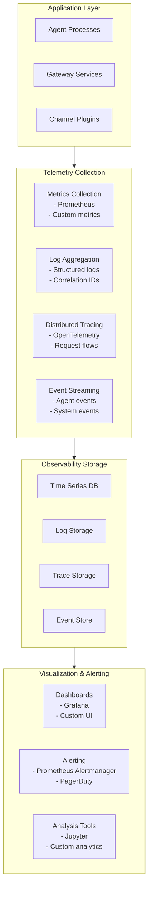
```mermaid
flowchart TB
    subgraph Application["Application Layer"]
        Agents[Agent Processes]
        Gateway[Gateway Services]
        Channels[Channel Plugins]
    end

    subgraph Telemetry["Telemetry Collection"]
        Metrics[Metrics Collection<br/>- Prometheus<br/>- Custom metrics]
        Logs[Log Aggregation<br/>- Structured logs<br/>- Correlation IDs]
        Traces[Distributed Tracing<br/>- OpenTelemetry<br/>- Request flows]
        Events[Event Streaming<br/>- Agent events<br/>- System events]
    end

    subgraph Storage["Observability Storage"]
        TimeSeries[Time Series DB]
        LogStore[Log Storage]
        TraceStore[Trace Storage]
        EventStore[Event Store]
    end

    subgraph Visualization["Visualization & Alerting"]
        Dashboards[Dashboards<br/>- Grafana<br/>- Custom UI]
        Alerting[Alerting<br/>- Prometheus Alertmanager<br/>- PagerDuty]
        Analysis[Analysis Tools<br/>- Jupyter<br/>- Custom analytics]
    end

    Application --> Telemetry
    Telemetry --> Storage
    Storage --> Visualization
```

#### Observability Flow Sequence

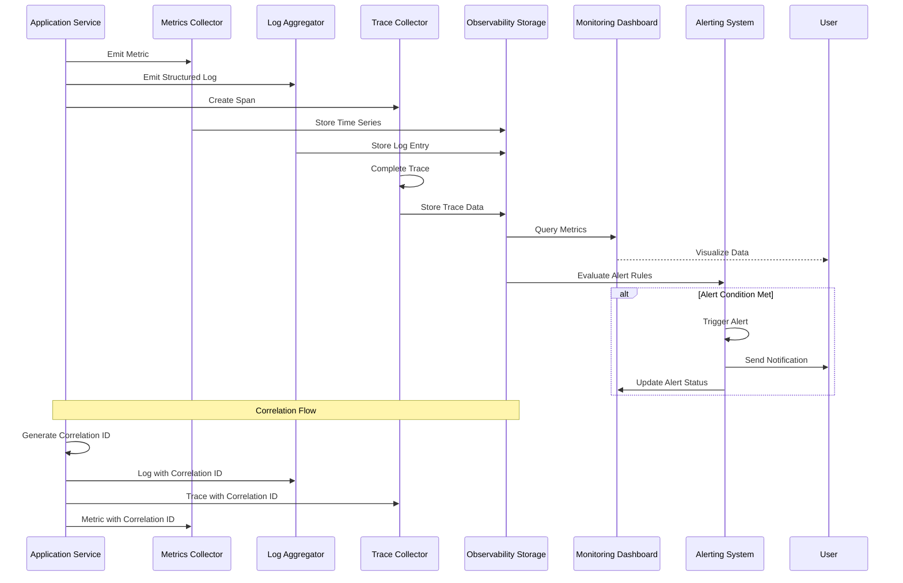
```mermaid
sequenceDiagram
    participant Service as Application Service
    participant Metrics as Metrics Collector
    participant Logs as Log Aggregator
    participant Traces as Trace Collector
    participant Storage as Observability Storage
    participant Dashboard as Monitoring Dashboard
    participant Alert as Alerting System
    
    Service->>Metrics: Emit Metric
    Service->>Logs: Emit Structured Log
    Service->>Traces: Create Span
    
    Metrics->>Storage: Store Time Series
    Logs->>Storage: Store Log Entry
    Traces->>Traces: Complete Trace
    Traces->>Storage: Store Trace Data
    
    Storage->>Dashboard: Query Metrics
    Dashboard-->>User: Visualize Data
    
    Storage->>Alert: Evaluate Alert Rules
    
    alt Alert Condition Met
        Alert->>Alert: Trigger Alert
        Alert->>User: Send Notification
        Alert->>Dashboard: Update Alert Status
    end
    
    Note over Service,Storage: Correlation Flow
    Service->>Service: Generate Correlation ID
    Service->>Logs: Log with Correlation ID
    Service->>Traces: Trace with Correlation ID
    Service->>Metrics: Metric with Correlation ID
```

### 2. Core Metrics Framework

> 📈 **Metrics Insight**: Use the RED method (Rate, Errors, Duration) for request metrics and the USE method (Utilization, Saturation, Errors) for resource metrics. Include business metrics to track system value.

```typescript
class MetricsCollector {
  private registry = new Registry();
  private correlationContext = new AsyncLocalStorage<CorrelationContext>();
  
  // Request metrics (RED method)
  private requestCounter = new Counter({
    name: 'http_requests_total',
    help: 'Total number of HTTP requests',
    labelNames: ['method', 'route', 'status_code', 'correlation_id']
  });
  
  private requestDuration = new Histogram({
    name: 'http_request_duration_seconds',
    help: 'HTTP request duration in seconds',
    labelNames: ['method', 'route', 'status_code'],
    buckets: [0.001, 0.005, 0.01, 0.05, 0.1, 0.5, 1, 2, 5, 10]
  });
  
  private errorCounter = new Counter({
    name: 'http_errors_total',
    help: 'Total number of HTTP errors',
    labelNames: ['method', 'route', 'status_code', 'error_type']
  });
  
  // Resource metrics (USE method)
  private cpuUtilization = new Gauge({
    name: 'cpu_utilization_percent',
    help: 'CPU utilization percentage',
    labelNames: ['instance', 'core']
  });
  
  private memoryUtilization = new Gauge({
    name: 'memory_utilization_bytes',
    help: 'Memory utilization in bytes',
    labelNames: ['instance', 'type']
  });
  
  // Business metrics
  private agentExecutions = new Counter({
    name: 'agent_executions_total',
    help: 'Total number of agent executions',
    labelNames: ['agent_type', 'model', 'status']
  });
  
  private toolExecutions = new Counter({
    name: 'tool_executions_total',
    help: 'Total number of tool executions',
    labelNames: ['tool_name', 'status', 'execution_time_ms']
  });
  
  private sessionMetrics = new Gauge({
    name: 'active_sessions',
    help: 'Number of active sessions',
    labelNames: ['channel', 'user_type']
  });
  
  // LLM-specific metrics
  private llmRequests = new Counter({
    name: 'llm_requests_total',
    help: 'Total number of LLM requests',
    labelNames: ['provider', 'model', 'status']
  });
  
  private llmTokens = new Counter({
    name: 'llm_tokens_total',
    help: 'Total number of LLM tokens',
    labelNames: ['provider', 'model', 'type'] // type: input, output
  });
  
  private llmResponseTime = new Histogram({
    name: 'llm_response_time_seconds',
    help: 'LLM response time in seconds',
    labelNames: ['provider', 'model'],
    buckets: [0.5, 1, 2, 5, 10, 20, 30, 60, 120]
  });
  
  recordHttpRequest(method: string, route: string, statusCode: number, duration: number): void {
    const context = this.correlationContext.getStore();
    const labels = {
      method,
      route,
      status_code: statusCode.toString()
    };
    
    this.requestCounter.inc({ ...labels, correlation_id: context?.correlationId || 'unknown' });
    this.requestDuration.observe(labels, duration / 1000);
    
    if (statusCode >= 400) {
      this.errorCounter.inc({
        ...labels,
        error_type: statusCode >= 500 ? 'server_error' : 'client_error'
      });
    }
  }
  
  recordAgentExecution(agentType: string, model: string, status: string, duration: number): void {
    this.agentExecutions.inc({ agent_type: agentType, model, status });
    
    // Also record as business metric
    this.businessCounter.inc({
      name: 'agent_execution_completed',
      status,
      agent_type: agentType
    });
  }
  
  recordToolExecution(toolName: string, status: string, duration: number): void {
    this.toolExecutions.inc({
      tool_name: toolName,
      status,
      execution_time_ms: duration.toString()
    });
  }
  
  recordLLMRequest(provider: string, model: string, status: string, duration: number, inputTokens: number, outputTokens: number): void {
    this.llmRequests.inc({ provider, model, status });
    this.llmTokens.inc({ provider, model, type: 'input' }, inputTokens);
    this.llmTokens.inc({ provider, model, type: 'output' }, outputTokens);
    this.llmResponseTime.observe({ provider, model }, duration / 1000);
  }
  
  updateResourceMetrics(instance: string): void {
    const cpuUsage = process.cpuUsage();
    const memUsage = process.memoryUsage();
    
    this.cpuUtilization.set({ instance, core: 'total' }, cpuUsage.user / 1000000); // Convert to seconds
    this.memoryUtilization.set({ instance, type: 'rss' }, memUsage.rss);
    this.memoryUtilization.set({ instance, type: 'heap_used' }, memUsage.heapUsed);
    this.memoryUtilization.set({ instance, type: 'heap_total' }, memUsage.heapTotal);
  }
  
  updateSessionMetrics(channel: string, userType: string, count: number): void {
    this.sessionMetrics.set({ channel, user_type: userType }, count);
  }
  
  // Custom business metrics
  private businessCounter = new Counter({
    name: 'business_events_total',
    help: 'Total number of business events',
    labelNames: ['name', 'status', 'agent_type']
  });
  
  recordBusinessEvent(name: string, status: string, agentType?: string): void {
    this.businessCounter.inc({
      name,
      status,
      agent_type: agentType || 'unknown'
    });
  }
  
  getMetrics(): Promise<string> {
    return this.registry.metrics();
  }
  
  // Middleware for automatic request metrics
  requestMetricsMiddleware() {
    return (req: Request, res: Response, next: NextFunction) => {
      const start = Date.now();
      const context = {
        correlationId: req.headers['x-correlation-id'] as string || this.generateCorrelationId(),
        requestId: this.generateRequestId()
      };
      
      this.correlationContext.run(context, () => {
        res.on('finish', () => {
          const duration = Date.now() - start;
          const route = req.route?.path || req.path || 'unknown';
          this.recordHttpRequest(req.method, route, res.statusCode, duration);
        });
        
        next();
      });
    };
  }
  
  private generateCorrelationId(): string {
    return `corr_${Date.now()}_${Math.random().toString(36).substr(2, 9)}`;
  }
  
  private generateRequestId(): string {
    return `req_${Date.now()}_${Math.random().toString(36).substr(2, 9)}`;
  }
}

interface CorrelationContext {
  correlationId: string;
  requestId: string;
  userId?: string;
  sessionId?: string;
}
```

### 3. Distributed Tracing Implementation

```typescript
import { trace, SpanKind, SpanStatusCode, Context } from '@opentelemetry/api';

class DistributedTracer {
  private tracer = trace.getTracer('ai-agent-system');
  
  startSpan(name: string, kind: SpanKind = SpanKind.INTERNAL): Span {
    return this.tracer.startSpan(name, { kind });
  }
  
  async traceAgentExecution<T>(
    agentId: string,
    model: string,
    operation: () => Promise<T>
  ): Promise<T> {
    const span = this.startSpan('agent.execution', SpanKind.SERVER);
    span.setAttributes({
      'agent.id': agentId,
      'agent.model': model,
      'agent.type': 'llm'
    });
    
    try {
      const result = await this.tracer.withActiveSpan(span, async () => {
        return await operation();
      });
      
      span.setStatus({ code: SpanStatusCode.OK });
      return result;
    } catch (error) {
      span.recordException(error as Error);
      span.setStatus({
        code: SpanStatusCode.ERROR,
        message: (error as Error).message
      });
      throw error;
    } finally {
      span.end();
    }
  }
  
  async traceToolExecution<T>(
    toolName: string,
    parameters: any,
    operation: () => Promise<T>
  ): Promise<T> {
    const span = this.startSpan('tool.execution', SpanKind.INTERNAL);
    span.setAttributes({
      'tool.name': toolName,
      'tool.parameters': JSON.stringify(parameters)
    });
    
    try {
      const result = await this.tracer.withActiveSpan(span, async () => {
        return await operation();
      });
      
      span.setStatus({ code: SpanStatusCode.OK });
      return result;
    } catch (error) {
      span.recordException(error as Error);
      span.setStatus({
        code: SpanStatusCode.ERROR,
        message: (error as Error).message
      });
      throw error;
    } finally {
      span.end();
    }
  }
  
  addTraceEvent(name: string, attributes: Record<string, any>): void {
    const span = trace.getActiveSpan();
    if (span) {
      span.addEvent(name, attributes);
    }
  }
}
```

---

## 🚀 DEPLOYMENT ARCHITECTURE

### 1. Container Architecture

> 🐳 **Container Insight**: Use multi-stage builds to minimize image size and attack surface. Separate build-time dependencies from runtime dependencies for better security and performance.

```mermaid
flowchart TB
    subgraph Kubernetes["Kubernetes Cluster"]
        subgraph Ingress["Ingress Layer"]
            IngressController[NGINX Ingress]
            TLS[Termination]
        end
        
        subgraph AppLayer["Application Layer"]
            GatewayPod[Gateway Pods<br/>- 3 replicas<br/>- Auto-scaling]
            AgentPod[Agent Pods<br/>- 5 replicas<br/>- Resource limits]
            WorkerPod[Worker Pods<br/>- 10 replicas<br/>- Job processing]
        end
        
        subgraph DataLayer["Data Layer"]
            RedisCluster[Redis Cluster<br/>- Session cache<br/>- Message broker]
            Postgres[PostgreSQL<br/>- Configuration<br/>- Audit logs]
            Prometheus[Prometheus<br/>- Metrics storage]
        end
        
        subgraph Storage["Storage Layer"]
            PV[Persistent Volumes<br/>- Agent workspaces<br/>- Sandbox storage]
            ObjectStorage[Object Storage<br/>- Media files<br/>- Backups]
        end
    end
    
    Ingress --> GatewayPod
    GatewayPod --> AgentPod
    AgentPod --> WorkerPod
    GatewayPod --> RedisCluster
    AgentPod --> Postgres
    WorkerPod --> PV
```

#### Deployment Sequence Diagram

```mermaid
sequenceDiagram
    participant CI as CI/CD Pipeline
    participant Registry as Container Registry
    participant K8s as Kubernetes API
    participant Ingress as Ingress Controller
    participant App as Application Pods
    participant Monitor as Monitoring System
    
    CI->>Registry: Build & Push Image
    CI->>K8s: Deploy New Version
    
    K8s->>K8s: Create Deployment
    K8s->>App: Start New Pods
    App->>Monitor: Register Health Checks
    
    Note over App,Monitor: Health Verification
    Monitor->>App: Health Check
    App-->>Monitor: Health Status
    
    alt Healthy
        Monitor->>K8s: Mark Ready
        K8s->>Ingress: Update Service
        Ingress->>Ingress: Route Traffic
        Monitor->>Monitor: Update Dashboards
    else Unhealthy
        Monitor->>K8s: Mark Unhealthy
        K8s->>App: Rollback Deployment
        Monitor->>Monitor: Alert Team
    end
```

### 2. Infrastructure as Code Template

> 🏗️ **IaC Insight**: Use modular, reusable IaC components. Implement proper state management and use remote state backends for team collaboration.

#### Terraform Module Structure

```hcl
# modules/agent-system/main.tf
resource "kubernetes_deployment" "gateway" {
  metadata {
    name = "ai-gateway"
    labels = {
      app = "ai-gateway"
      version = var.version
    }
  }
  
  spec {
    replicas = var.gateway_replicas
    
    selector {
      match_labels = {
        app = "ai-gateway"
      }
    }
    
    template {
      metadata {
        labels = {
          app = "ai-gateway"
          version = var.version
        }
        annotations = {
          "prometheus.io/scrape" = "true"
          "prometheus.io/port" = "9090"
          "prometheus.io/path" = "/metrics"
        }
      }
      
      spec {
        security_context {
          run_as_non_root = true
          run_as_user = 1000
          fs_group = 1000
        }
        
        container {
          name = "gateway"
          image = "ai-system/gateway:${var.version}"
          image_pull_policy = "IfNotPresent"
          
          resources {
            limits = {
              cpu    = "500m"
              memory = "512Mi"
            }
            requests = {
              cpu    = "250m"
              memory = "256Mi"
            }
          }
          
          env {
            name  = "REDIS_URL"
            value = var.redis_url
          }
          
          env {
            name = "DATABASE_URL"
            value_from {
              secret_key_ref {
                name = "database-secret"
                key  = "url"
              }
            }
          }
          
          port {
            container_port = 8080
            protocol = "TCP"
          }
          
          liveness_probe {
            http_get {
              path = "/health"
              port = 8080
            }
            initial_delay_seconds = 30
            period_seconds = 10
            timeout_seconds = 5
            failure_threshold = 3
          }
          
          readiness_probe {
            http_get {
              path = "/ready"
              port = 8080
            }
            initial_delay_seconds = 5
            period_seconds = 5
            timeout_seconds = 3
            failure_threshold = 3
          }
          
          security_context {
            allow_privilege_escalation = false
            read_only_root_filesystem = true
            capabilities {
              drop = ["ALL"]
            }
          }
        }
        
        image_pull_secrets {
          name = "registry-secret"
        }
      }
    }
  }
}

resource "kubernetes_horizontal_pod_autoscaler" "gateway" {
  metadata {
    name = "ai-gateway-hpa"
  }
  
  spec {
    scale_target_ref {
      api_version = "apps/v1"
      kind = "Deployment"
      name = "ai-gateway"
    }
    
    min_replicas = var.min_replicas
    max_replicas = var.max_replicas
    
    metric {
      type = "Resource"
      resource {
        name = "cpu"
        target {
          type = "Utilization"
          average_utilization = 70
        }
      }
    }
    
    metric {
      type = "Resource"
      resource {
        name = "memory"
        target {
          type = "Utilization"
          average_utilization = 80
        }
      }
    }
  }
}

resource "kubernetes_service" "gateway" {
  metadata {
    name = "ai-gateway-service"
    labels = {
      app = "ai-gateway"
    }
  }
  
  spec {
    selector = {
      app = "ai-gateway"
    }
    
    port {
      port        = 80
      target_port = 8080
      protocol    = "TCP"
    }
    
    type = "ClusterIP"
  }
}

resource "kubernetes_network_policy" "gateway" {
  metadata {
    name = "ai-gateway-netpol"
  }
  
  spec {
    pod_selector {
      match_labels = {
        app = "ai-gateway"
      }
    }
    
    policy_types = ["Ingress", "Egress"]
    
    ingress {
      from {
        pod_selector {
          match_labels = {
            app = "ingress-controller"
          }
        }
      }
      ports {
        protocol = "TCP"
        port = 8080
      }
    }
    
    egress {
      to {
        pod_selector {
          match_labels = {
            app = "redis"
          }
        }
      }
      ports {
        protocol = "TCP"
        port = 6379
      }
    }
    
    egress {
      to {
        pod_selector {
          match_labels = {
            app = "postgres"
          }
        }
      }
      ports {
        protocol = "TCP"
        port = 5432
      }
    }
  }
}
```

#### Variables and Outputs

```hcl
# modules/agent-system/variables.tf
variable "version" {
  description = "Application version"
  type        = string
}

variable "gateway_replicas" {
  description = "Number of gateway replicas"
  type        = number
  default     = 3
}

variable "min_replicas" {
  description = "Minimum number of replicas for HPA"
  type        = number
  default     = 2
}

variable "max_replicas" {
  description = "Maximum number of replicas for HPA"
  type        = number
  default     = 10
}

variable "redis_url" {
  description = "Redis connection URL"
  type        = string
  sensitive   = true
}

variable "resource_limits" {
  description = "Resource limits for containers"
  type = object({
    cpu_limit    = string
    memory_limit = string
    cpu_request  = string
    memory_request = string
  })
  default = {
    cpu_limit      = "500m"
    memory_limit   = "512Mi"
    cpu_request    = "250m"
    memory_request = "256Mi"
  }
}

# modules/agent-system/outputs.tf
output "gateway_service_name" {
  description = "Name of the gateway service"
  value       = kubernetes_service.gateway.metadata.0.name
}

output "gateway_deployment_name" {
  description = "Name of the gateway deployment"
  value       = kubernetes_deployment.gateway.metadata.0.name
}

output "hpa_name" {
  description = "Name of the HPA"
  value       = kubernetes_horizontal_pod_autoscaler.gateway.metadata.0.name
}
```

---

## 🧪 TESTING STRATEGY

### 1. Testing Pyramid

> 🧪 **Testing Insight**: Follow the testing pyramid with more unit tests than integration tests, and more integration tests than E2E tests. Each level should catch different types of issues.

```mermaid
pyramid
    title Testing Strategy Pyramid
    
    "E2E Tests<br/>- User workflows<br/>- Integration scenarios<br/>- Performance tests" : 10
    
    "Integration Tests<br/>- API tests<br/>- Database tests<br/>- Service integration" : 30
    
    "Unit Tests<br/>- Function tests<br/>- Class tests<br/>- Module tests" : 70
```

### 2. Test Implementation Framework

> 🔬 **Test Framework Insight**: Use consistent test patterns and utilities. Implement test data factories and mocks for reliable, repeatable tests.

```typescript
// Test utilities and factories
class TestDataFactory {
  static createTestMessage(overrides: Partial<Message> = {}): Message {
    return {
      id: this.generateId(),
      content: 'Test message content',
      author: 'test-user',
      timestamp: new Date().toISOString(),
      channel: 'test-channel',
      ...overrides
    };
  }
  
  static createTestAgentConfig(overrides: Partial<AgentConfig> = {}): AgentConfig {
    return {
      id: 'test-agent',
      name: 'Test Agent',
      workspace: '/tmp/test-workspace',
      model: {
        provider: 'anthropic',
        model: 'claude-3-sonnet',
        fallbacks: []
      },
      tools: [],
      security: {
        sandbox: true,
        allowedTools: ['read', 'write']
      },
      memory: {
        maxMessages: 100,
        contextWindow: 4000
      },
      ...overrides
    };
  }
  
  private static generateId(): string {
    return `test_${Date.now()}_${Math.random().toString(36).substr(2, 9)}`;
  }
}

// Mock implementations
class MockLLMProvider implements LLMProvider {
  private responses: string[] = [];
  private toolCalls: ToolCall[] = [];
  private callCount = 0;
  
  setResponse(response: string): void {
    this.responses.push(response);
  }
  
  setToolCall(toolName: string, parameters: any): void {
    this.toolCalls.push({ name: toolName, parameters });
  }
  
  async complete(prompt: string, options?: CompletionOptions): Promise<CompletionResponse> {
    this.callCount++;
    
    const response = this.responses.shift() || 'Default test response';
    const toolCall = this.toolCalls.shift();
    
    return {
      text: response,
      toolCalls: toolCall ? [toolCall] : [],
      usage: {
        inputTokens: 100,
        outputTokens: 50,
        totalTokens: 150
      },
      model: 'test-model',
      finishReason: toolCall ? 'tool_calls' : 'stop'
    };
  }
  
  getCallCount(): number {
    return this.callCount;
  }
  
  getToolCalls(): ToolCall[] {
    return this.toolCalls;
  }
  
  reset(): void {
    this.responses = [];
    this.toolCalls = [];
    this.callCount = 0;
  }
}

// Integration test framework
describe('Agent System Integration', () => {
  let testGateway: TestGateway;
  let mockLLM: MockLLMProvider;
  let agentRunner: AgentRunner;
  let testDatabase: TestDatabase;
  let testRedis: TestRedis;
  
  beforeAll(async () => {
    // Setup test infrastructure
    testDatabase = new TestDatabase();
    testRedis = new TestRedis();
    await testDatabase.setup();
    await testRedis.setup();
  });
  
  afterAll(async () => {
    // Cleanup test infrastructure
    await testDatabase.cleanup();
    await testRedis.cleanup();
  });
  
  beforeEach(async () => {
    // Setup test components
    mockLLM = new MockLLMProvider();
    testGateway = new TestGateway();
    
    agentRunner = new AgentRunner({
      llmProvider: mockLLM,
      gateway: testGateway,
      database: testDatabase,
      redis: testRedis
    });
    
    // Reset test data
    await testDatabase.clear();
    await testRedis.clear();
    mockLLM.reset();
  });
  
  describe('Message Processing', () => {
    it('should process simple message end-to-end', async () => {
      // Arrange
      const message = TestDataFactory.createTestMessage({
        content: 'Hello, world!'
      });
      mockLLM.setResponse('Hello! How can I help you today?');
      
      // Act
      const response = await agentRunner.processMessage(message);
      
      // Assert
      expect(response.text).toBe('Hello! How can I help you today?');
      expect(mockLLM.getCallCount()).toBe(1);
      expect(testGateway.getLastSentMessage()).toEqual(response);
      
      // Verify database state
      const session = await testDatabase.getSession(message.sessionId);
      expect(session.messages).toHaveLength(2); // Original + response
    });
    
    it('should handle tool execution with security', async () => {
      // Arrange
      const message = TestDataFactory.createTestMessage({
        content: 'List files in current directory'
      });
      mockLLM.setToolCall('read', { path: '.' });
      mockLLM.setResponse('Files: file1.txt, file2.txt');
      
      // Act
      const response = await agentRunner.processMessage(message);
      
      // Assert
      expect(response.text).toContain('file1.txt');
      expect(mockLLM.getToolCalls()).toHaveLength(1);
      
      // Verify security policies were enforced
      const toolExecution = await testDatabase.getToolExecution(mockLLM.getToolCalls()[0].id);
      expect(toolExecution.securityChecksPassed).toBe(true);
      expect(toolExecution.sandboxUsed).toBe(true);
    });
    
    it('should handle LLM provider failures gracefully', async () => {
      // Arrange
      const message = TestDataFactory.createTestMessage();
      mockLLM.setResponse(''); // Empty response to simulate failure
      
      // Mock LLM failure
      jest.spyOn(mockLLM, 'complete').mockRejectedValue(new Error('LLM service unavailable'));
      
      // Act & Assert
      await expect(agentRunner.processMessage(message)).rejects.toThrow('LLM service unavailable');
      
      // Verify error handling
      const errorLog = await testDatabase.getErrorLog(message.id);
      expect(errorLog.error).toContain('LLM service unavailable');
      expect(errorLog.recovered).toBe(false);
    });
  });
  
  describe('Session Management', () => {
    it('should maintain session context across messages', async () => {
      // Arrange
      const sessionId = TestDataFactory.generateId();
      const message1 = TestDataFactory.createTestMessage({
        sessionId,
        content: 'My name is Alice'
      });
      const message2 = TestDataFactory.createTestMessage({
        sessionId,
        content: 'What is my name?'
      });
      
      mockLLM.setResponse('Nice to meet you, Alice!');
      mockLLM.setResponse('Your name is Alice.');
      
      // Act
      await agentRunner.processMessage(message1);
      const response2 = await agentRunner.processMessage(message2);
      
      // Assert
      expect(response2.text).toContain('Alice');
      
      // Verify session context
      const session = await testDatabase.getSession(sessionId);
      expect(session.messages).toHaveLength(4); // 2 messages + 2 responses
      expect(session.context.userName).toBe('Alice');
    });
    
    it('should compact session when context window is exceeded', async () => {
      // Arrange
      const sessionId = TestDataFactory.generateId();
      const config = TestDataFactory.createTestAgentConfig({
        memory: { maxMessages: 5, contextWindow: 1000 }
      });
      
      // Create messages that exceed context window
      const messages = Array.from({ length: 10 }, (_, i) =>
        TestDataFactory.createTestMessage({
          sessionId,
          content: `Message ${i + 1}`.repeat(100) // Long message
        })
      );
      
      mockLLM.setResponse('Response received');
      
      // Act
      for (const message of messages) {
        await agentRunner.processMessage(message);
      }
      
      // Assert
      const session = await testDatabase.getSession(sessionId);
      expect(session.messages.length).toBeLessThanOrEqual(5); // Compacted
      expect(session.compactionCount).toBeGreaterThan(0);
    });
  });
  
  describe('Performance Tests', () => {
    it('should handle concurrent message processing', async () => {
      // Arrange
      const concurrentMessages = 50;
      const messages = Array.from({ length: concurrentMessages }, () =>
        TestDataFactory.createTestMessage()
      );
      
      mockLLM.setResponse('Quick response');
      
      // Act
      const startTime = Date.now();
      const promises = messages.map(msg => agentRunner.processMessage(msg));
      const responses = await Promise.all(promises);
      const duration = Date.now() - startTime;
      
      // Assert
      expect(responses).toHaveLength(concurrentMessages);
      expect(duration).toBeLessThan(5000); // Should complete within 5 seconds
      expect(mockLLM.getCallCount()).toBe(concurrentMessages);
      
      // Verify no resource exhaustion
      const metrics = await testRedis.getMetrics();
      expect(metrics.activeConnections).toBeLessThan(100);
    });
  });
});

// Performance benchmark tests
describe('Performance Benchmarks', () => {
  it('should meet response time SLA', async () => {
    const agentRunner = new AgentRunner(/* config */);
    const message = TestDataFactory.createTestMessage();
    
    const startTime = performance.now();
    await agentRunner.processMessage(message);
    const duration = performance.now() - startTime;
    
    expect(duration).toBeLessThan(2000); // 2 second SLA
  });
  
  it('should handle memory usage within limits', async () => {
    const initialMemory = process.memoryUsage().heapUsed;
    
    // Process many messages
    for (let i = 0; i < 1000; i++) {
      const message = TestDataFactory.createTestMessage();
      await agentRunner.processMessage(message);
    }
    
    const finalMemory = process.memoryUsage().heapUsed;
    const memoryIncrease = finalMemory - initialMemory;
    
    // Memory increase should be reasonable (< 100MB)
    expect(memoryIncrease).toBeLessThan(100 * 1024 * 1024);
  });
});
```

---

## � TROUBLESHOOTING & DEBUGGING

### 1. Common Issues and Solutions

> 🐛 **Debugging Insight**: Implement structured logging with correlation IDs from the start. This makes troubleshooting distributed systems much easier.

#### Performance Issues

**Symptom**: High response times (>2s)
```typescript
// Diagnostic script
async function diagnosePerformanceIssues() {
  const metrics = await collectSystemMetrics();
  
  console.log('=== Performance Diagnosis ===');
  console.log(`CPU Usage: ${metrics.cpu}%`);
  console.log(`Memory Usage: ${metrics.memory}%`);
  console.log(`Active Connections: ${metrics.connections}`);
  console.log(`Queue Depth: ${metrics.queueDepth}`);
  
  // Check common bottlenecks
  if (metrics.cpu > 80) {
    console.log('⚠️  High CPU usage detected:');
    console.log('- Consider scaling horizontally');
    console.log('- Check for infinite loops or inefficient algorithms');
    console.log('- Profile CPU-intensive operations');
  }
  
  if (metrics.memory > 85) {
    console.log('⚠️  High memory usage detected:');
    console.log('- Check for memory leaks');
    console.log('- Implement session compaction');
    console.log('- Consider increasing memory limits');
  }
  
  if (metrics.queueDepth > 100) {
    console.log('⚠️  High queue depth detected:');
    console.log('- Scale agent workers');
    console.log('- Check for blocking operations');
    console.log('- Implement backpressure mechanisms');
  }
  
  if (metrics.connections > 1000) {
    console.log('⚠️  High connection count detected:');
    console.log('- Implement connection pooling');
    console.log('- Check for connection leaks');
    console.log('- Set connection timeouts');
  }
}
```

**Solution**: Implement the following optimizations:
1. Add connection pooling for database and external services
2. Implement request queuing with backpressure
3. Use caching for frequently accessed data
4. Optimize database queries with proper indexing

#### LLM Provider Issues

**Symptom**: Frequent LLM timeouts or failures
```typescript
// LLM provider health check
class LLMProviderHealthMonitor {
  private providers: Map<string, LLMProviderHealth> = new Map();
  
  async checkProviderHealth(provider: string): Promise<LLMProviderHealth> {
    const startTime = Date.now();
    
    try {
      // Simple health check request
      const response = await this.llmProvider.complete('Health check', {
        maxTokens: 10,
        timeout: 5000
      });
      
      const responseTime = Date.now() - startTime;
      
      return {
        provider,
        status: 'healthy',
        responseTime,
        lastCheck: new Date(),
        errorCount: 0
      };
    } catch (error) {
      const health = this.providers.get(provider) || { errorCount: 0 };
      
      return {
        provider,
        status: health.errorCount > 5 ? 'unhealthy' : 'degraded',
        responseTime: -1,
        lastCheck: new Date(),
        errorCount: health.errorCount + 1,
        lastError: error.message
      };
    }
  }
  
  async getHealthyProvider(): Promise<string | null> {
    for (const [provider, health] of this.providers) {
      if (health.status === 'healthy' && health.responseTime < 10000) {
        return provider;
      }
    }
    return null;
  }
}
```

**Solution**: 
1. Implement circuit breakers for LLM providers
2. Add retry logic with exponential backoff
3. Use multiple providers with failover
4. Monitor provider health and performance

#### Memory Leaks

**Symptom**: Memory usage increases continuously over time
```typescript
// Memory leak detection
class MemoryLeakDetector {
  private snapshots: MemorySnapshot[] = [];
  private checkInterval = 60000; // 1 minute
  
  startMonitoring(): void {
    setInterval(() => {
      const snapshot = this.captureSnapshot();
      this.snapshots.push(snapshot);
      
      // Keep only last 100 snapshots
      if (this.snapshots.length > 100) {
        this.snapshots.shift();
      }
      
      this.analyzeTrends();
    }, this.checkInterval);
  }
  
  private captureSnapshot(): MemorySnapshot {
    const usage = process.memoryUsage();
    return {
      timestamp: Date.now(),
      heapUsed: usage.heapUsed,
      heapTotal: usage.heapTotal,
      external: usage.external,
      rss: usage.rss
    };
  }
  
  private analyzeTrends(): void {
    if (this.snapshots.length < 10) return;
    
    const recent = this.snapshots.slice(-10);
    const oldest = recent[0];
    const latest = recent[recent.length - 1];
    
    const growthRate = (latest.heapUsed - oldest.heapUsed) / (latest.timestamp - oldest.timestamp);
    
    if (growthRate > 1024 * 1024) { // > 1MB/minute
      console.warn('⚠️  Potential memory leak detected');
      console.warn(`Growth rate: ${(growthRate / 1024 / 1024).toFixed(2)} MB/minute`);
      
      // Trigger garbage collection
      if (global.gc) {
        global.gc();
        
        // Check if growth continues after GC
        setTimeout(() => {
          const afterGC = this.captureSnapshot();
          const continuedGrowth = afterGC.heapUsed - latest.heapUsed;
          
          if (continuedGrowth > 50 * 1024 * 1024) { // > 50MB growth after GC
            console.error('🚨 Memory leak confirmed - investigate immediately');
            this.generateHeapDump();
          }
        }, 5000);
      }
    }
  }
  
  private generateHeapDump(): void {
    const heapdump = require('heapdump');
    const filename = `heapdump-${Date.now()}.heapsnapshot`;
    heapdump.writeSnapshot(filename);
    console.log(`Heap dump written to: ${filename}`);
  }
}
```

### 2. Debugging Tools and Techniques

#### Distributed Tracing Setup
```typescript
// Debugging middleware for request tracing
class DebuggingMiddleware {
  static requestTracer() {
    return (req: Request, res: Response, next: NextFunction) => {
      const traceId = req.headers['x-trace-id'] || this.generateTraceId();
      const spanId = this.generateSpanId();
      
      // Add trace headers
      req.traceId = traceId;
      req.spanId = spanId;
      res.setHeader('x-trace-id', traceId);
      
      // Log request start
      console.log(JSON.stringify({
        event: 'request_start',
        traceId,
        spanId,
        method: req.method,
        url: req.url,
        userAgent: req.headers['user-agent'],
        timestamp: new Date().toISOString()
      }));
      
      // Measure duration
      const startTime = process.hrtime.bigint();
      
      res.on('finish', () => {
        const endTime = process.hrtime.bigint();
        const duration = Number(endTime - startTime) / 1000000; // Convert to milliseconds
        
        console.log(JSON.stringify({
          event: 'request_end',
          traceId,
          spanId,
          statusCode: res.statusCode,
          duration: `${duration.toFixed(2)}ms`,
          timestamp: new Date().toISOString()
        }));
      });
      
      next();
    };
  }
  
  private static generateTraceId(): string {
    return `trace_${Date.now()}_${Math.random().toString(36).substr(2, 9)}`;
  }
  
  private static generateSpanId(): string {
    return Math.random().toString(36).substr(2, 9);
  }
}
```

#### Real-time Debugging Dashboard
```typescript
// Debugging dashboard for real-time monitoring
class DebuggingDashboard {
  private metrics: Map<string, any> = new Map();
  private alerts: Alert[] = [];
  
  updateMetric(name: string, value: any): void {
    this.metrics.set(name, {
      value,
      timestamp: new Date(),
      history: this.getHistory(name).concat({ value, timestamp: new Date() }).slice(-100)
    });
    
    this.checkThresholds(name, value);
  }
  
  private checkThresholds(metric: string, value: any): void {
    const thresholds = {
      'response_time': { warning: 1000, critical: 2000 },
      'error_rate': { warning: 0.05, critical: 0.1 },
      'memory_usage': { warning: 0.8, critical: 0.95 },
      'cpu_usage': { warning: 0.7, critical: 0.9 }
    };
    
    const threshold = thresholds[metric];
    if (!threshold) return;
    
    if (value >= threshold.critical) {
      this.createAlert('critical', metric, value);
    } else if (value >= threshold.warning) {
      this.createAlert('warning', metric, value);
    }
  }
  
  private createAlert(severity: string, metric: string, value: any): void {
    const alert: Alert = {
      id: this.generateAlertId(),
      severity,
      metric,
      value,
      timestamp: new Date(),
      acknowledged: false
    };
    
    this.alerts.push(alert);
    
    // Keep only last 50 alerts
    if (this.alerts.length > 50) {
      this.alerts.shift();
    }
    
    // Send notification for critical alerts
    if (severity === 'critical') {
      this.sendNotification(alert);
    }
  }
  
  getDashboardData(): DashboardData {
    return {
      metrics: Object.fromEntries(this.metrics),
      alerts: this.alerts.slice(-20),
      timestamp: new Date()
    };
  }
}
```

---

## 📈 PERFORMANCE OPTIMIZATION

### 1. Caching Strategies

> ⚡ **Caching Insight**: Implement multi-level caching with different TTLs. Cache at the edge, application, and database levels for maximum performance.

```typescript
// Multi-level caching system
class MultiLevelCache {
  private l1Cache = new Map<string, CacheItem>(); // Memory cache
  private l2Cache: RedisClient; // Redis cache
  private l3Cache: DatabaseCache; // Database cache
  
  async get(key: string): Promise<any> {
    // L1 Cache (Memory)
    const l1Item = this.l1Cache.get(key);
    if (l1Item && !this.isExpired(l1Item)) {
      return l1Item.value;
    }
    
    // L2 Cache (Redis)
    try {
      const l2Value = await this.l2Cache.get(key);
      if (l2Value) {
        const parsed = JSON.parse(l2Value);
        // Promote to L1
        this.l1Cache.set(key, {
          value: parsed,
          timestamp: Date.now(),
          ttl: this.getTTL(key, 'l1')
        });
        return parsed;
      }
    } catch (error) {
      console.warn('Redis cache miss:', error);
    }
    
    // L3 Cache (Database)
    const l3Value = await this.l3Cache.get(key);
    if (l3Value) {
      // Promote to L2 and L1
      await this.set(key, l3Value);
      return l3Value;
    }
    
    return null;
  }
  
  async set(key: string, value: any, customTTL?: number): Promise<void> {
    const now = Date.now();
    
    // Set in all levels
    this.l1Cache.set(key, {
      value,
      timestamp: now,
      ttl: customTTL || this.getTTL(key, 'l1')
    });
    
    try {
      await this.l2Cache.setex(
        key,
        Math.floor((customTTL || this.getTTL(key, 'l2')) / 1000),
        JSON.stringify(value)
      );
    } catch (error) {
      console.warn('Redis cache set failed:', error);
    }
    
    await this.l3Cache.set(key, value, customTTL || this.getTTL(key, 'l3'));
  }
  
  private getTTL(key: string, level: 'l1' | 'l2' | 'l3'): number {
    const ttls = {
      l1: 5 * 60 * 1000,    // 5 minutes
      l2: 30 * 60 * 1000,   // 30 minutes
      l3: 2 * 60 * 60 * 1000 // 2 hours
    };
    
    // Adjust TTL based on key pattern
    if (key.startsWith('session:')) return ttls.l1;
    if (key.startsWith('config:')) return ttls.l3;
    if (key.startsWith('cache:')) return ttls.l2;
    
    return ttls[level];
  }
}
```

### 2. Database Optimization

```typescript
// Database query optimizer
class QueryOptimizer {
  private queryCache = new Map<string, OptimizedQuery>();
  
  async optimizeQuery(sql: string, params: any[]): Promise<OptimizedQuery> {
    const cacheKey = this.generateQueryKey(sql, params);
    
    if (this.queryCache.has(cacheKey)) {
      return this.queryCache.get(cacheKey)!;
    }
    
    const optimized = await this.analyzeAndOptimize(sql, params);
    this.queryCache.set(cacheKey, optimized);
    
    return optimized;
  }
  
  private async analyzeAndOptimize(sql: string, params: any[]): Promise<OptimizedQuery> {
    // Analyze query plan
    const explain = await this.db.query(`EXPLAIN ANALYZE ${sql}`, params);
    
    // Check for missing indexes
    const missingIndexes = this.findMissingIndexes(explain);
    
    // Suggest optimizations
    const optimizations = this.suggestOptimizations(explain);
    
    return {
      originalSQL: sql,
      optimizedSQL: this.applyOptimizations(sql, optimizations),
      missingIndexes,
      optimizations,
      estimatedCost: explain[0]?.['Total Cost'] || 0,
      executionTime: explain[0]?.['Execution Time'] || 0
    };
  }
  
  private findMissingIndexes(explain: any[]): string[] {
    const missingIndexes: string[] = [];
    
    for (const row of explain) {
      if (row['Node Type'] === 'Seq Scan' && row['Relation Name']) {
        missingIndexes.push(`Consider adding index on ${row['Relation Name']}`);
      }
    }
    
    return missingIndexes;
  }
}
```

### 3. Connection Pooling

```typescript
// Advanced connection pool with health checking
class AdvancedConnectionPool {
  private pool: Connection[] = [];
  private waiting: Array<{ resolve: Function; reject: Function; timeout: NodeJS.Timeout }> = [];
  private healthCheckInterval: NodeJS.Timeout;
  
  constructor(private config: PoolConfig) {
    this.startHealthChecks();
  }
  
  async acquire(): Promise<Connection> {
    // Try to get healthy connection from pool
    const healthyConnection = this.pool.find(conn => conn.isHealthy());
    if (healthyConnection) {
      this.pool = this.pool.filter(conn => conn !== healthyConnection);
      return healthyConnection;
    }
    
    // Create new connection if under limit
    if (this.pool.length + this.waiting.length < this.config.maxSize) {
      return this.createConnection();
    }
    
    // Wait for available connection
    return new Promise((resolve, reject) => {
      const timeout = setTimeout(() => {
        const index = this.waiting.findIndex(w => w.resolve === resolve);
        if (index !== -1) {
          this.waiting.splice(index, 1);
        }
        reject(new Error('Connection timeout'));
      }, this.config.acquireTimeout);
      
      this.waiting.push({ resolve, reject, timeout });
    });
  }
  
  async release(connection: Connection): void {
    if (!connection.isHealthy()) {
      await connection.close();
      return;
    }
    
    // Return to pool if someone is waiting
    if (this.waiting.length > 0) {
      const waiter = this.waiting.shift()!;
      clearTimeout(waiter.timeout);
      waiter.resolve(connection);
    } else {
      this.pool.push(connection);
    }
  }
  
  private startHealthChecks(): void {
    this.healthCheckInterval = setInterval(async () => {
      for (const connection of this.pool) {
        try {
          await connection.ping();
        } catch (error) {
          // Remove unhealthy connection
          this.pool = this.pool.filter(conn => conn !== connection);
          await connection.close();
        }
      }
    }, this.config.healthCheckInterval);
  }
}
```

---

## 📋 IMPLEMENTATION CHECKLISTS

### 1. Architecture Review Checklist

#### Security Review

- ✅ Input validation implemented for all external inputs
- ✅ Authentication and authorization properly configured
- ✅ Secrets management in place (no hardcoded credentials)
- ✅ Security scanning integrated in CI/CD
- ✅ Rate limiting and DoS protection configured
- ✅ Audit logging enabled for sensitive operations
- ✅ Network security groups properly configured
- ✅ Container security best practices followed

#### Performance Review

- ✅ Resource limits configured for all components
- ✅ Caching strategy implemented where appropriate
- ✅ Database queries optimized and indexed
- ✅ Connection pooling configured
- ✅ Async patterns used for I/O operations
- ✅ Memory leaks identified and fixed
- ✅ Load testing performed and results documented
- ✅ Monitoring and alerting configured

#### Reliability Review

- ✅ Circuit breakers implemented for external dependencies
- ✅ Retry logic with exponential backoff
- ✅ Health checks implemented for all services
- ✅ Graceful shutdown handling
- ✅ Backup and recovery procedures documented
- ✅ Disaster recovery plan tested
- ✅ High availability configuration validated
- ✅ Error handling and logging comprehensive

### 2. Code Quality Checklist

#### Design Principles

- ✅ SOLID principles followed
- ✅ Dependency inversion implemented
- ✅ Single responsibility respected
- ✅ Interface segregation applied
- ✅ Open/closed principle maintained

#### Code Standards

- ✅ Consistent naming conventions
- ✅ Proper error handling
- ✅ Comprehensive test coverage
- ✅ Documentation updated
- ✅ Code reviewed by peers
- ✅ Static analysis passed
- ✅ Security vulnerabilities addressed
- ✅ Performance benchmarks met

---

## 🎯 QUICK START GUIDE

### 1. Project Structure Template

```
agentic-ai-system/
├── src/
│   ├── agents/           # Agent runtime and tools
│   │   ├── core/         # Core agent logic
│   │   ├── tools/        # Tool implementations
│   │   └── subagents/    # Subagent system
│   ├── channels/         # Channel adapters
│   │   ├── core/         # Core channels
│   │   └── plugins/      # Extension channels
│   ├── gateway/          # Gateway server
│   │   ├── server/       # Server implementation
│   │   ├── auth/         # Authentication
│   │   └── routing/      # Message routing
│   ├── security/         # Security framework
│   │   ├── policies/     # Security policies
│   │   ├── validation/   # Input validation
│   │   └── sandbox/      # Sandbox system
│   ├── monitoring/       # Observability
│   │   ├── metrics/      # Metrics collection
│   │   ├── logging/      # Structured logging
│   │   └── tracing/      # Distributed tracing
│   └── config/           # Configuration management
├── plugins/              # Extension plugins
├── tests/                # Test suites
├── docs/                 # Documentation
├── deployments/          # Infrastructure as code
├── scripts/              # Build and deployment scripts
└── examples/             # Usage examples
```

### 2. Core Dependencies

```json
{
  "dependencies": {
    "@fastify/websocket": "^10.0.0",
    "prom-client": "^15.0.0",
    "winston": "^3.10.0",
    "ajv": "^8.12.0",
    "ioredis": "^5.3.0",
    "pg": "^8.11.0",
    "@opentelemetry/api": "^1.4.0",
    "@opentelemetry/sdk-node": "^0.35.0"
  },
  "devDependencies": {
    "jest": "^29.7.0",
    "typescript": "^5.2.0",
    "eslint": "^8.50.0",
    "prettier": "^3.0.0",
    "@types/node": "^20.0.0"
  }
}
```

### 3. Configuration Template

```yaml
# config/default.yml
server:
  port: 8080
  host: "0.0.0.0"

security:
  authentication:
    enabled: true
    providers: ["jwt", "oauth"]
  authorization:
    policy_engine: "rbac"
    default_deny: true

agents:
  defaults:
    model:
      provider: "anthropic"
      model: "claude-3-sonnet"
      fallbacks: ["gpt-4", "local-model"]
    tools:
      allow: ["read", "write", "search"]
      deny: ["network", "system"]
    sandbox:
      enabled: true
      mode: "docker"

channels:
  - type: "discord"
    enabled: true
    config:
      token: "${DISCORD_TOKEN}"
  - type: "telegram"
    enabled: false
    config:
      token: "${TELEGRAM_TOKEN}"

monitoring:
  metrics:
    enabled: true
    port: 9090
  logging:
    level: "info"
    format: "json"
  tracing:
    enabled: true
    sampling: 0.1
```

---

## 🔮 FUTURE EVOLUTION ROADMAP

### Technology Adoption Strategy

| Technology | Adoption Phase | Timeline | Rationale |
|------------|----------------|----------|-----------|
| **Rust for Core Components** | Adopt | Q2 2024 | Performance, safety, memory management |
| **WebAssembly for Tools** | Assess | Q3 2024 | Portability, sandboxing, performance |
| **GraphQL API** | Adopt | Q1 2024 | Type safety, efficient queries |
| **Event Sourcing** | Adopt | Q2 2024 | Audit trails, temporal queries |
| **Distributed Tracing** | Adopt | Q1 2024 | Observability, debugging |
| **Machine Learning Ops** | Assess | Q4 2024 | Model lifecycle, performance |

### Architecture Evolution Phases

```mermaid
timeline
    title Architecture Evolution Roadmap
    
    section Phase 1: Foundation
        Core Architecture : Multi-layer design<br/>Plugin system<br/>Basic security
        : Q1 2024
    
    section Phase 2: Intelligence
        Self-Governance : Policy engine<br/>Adaptive behavior<br/>Learning system
        : Q2 2024
    
    section Phase 3: Scale
        Distributed Systems : Microservices<br/>Event streaming<br/>Global deployment
        : Q3 2024
    
    section Phase 4: AI-Native
        Advanced AI : Multi-agent systems<br/>Collective intelligence<br/>Autonomous operations
        : Q4 2024
```

---

## 📚 REFERENCE IMPLEMENTATIONS

### 1. Starter Templates

#### Basic Agent System

```typescript
// Minimal agent implementation
class BasicAgent {
  private tools = new ToolRegistry();
  private policy = new SecurityPolicy();
  
  async processMessage(message: string): Promise<string> {
    // Validate input
    this.policy.validateInput(message);
    
    // Process with LLM
    const response = await this.callLLM(message);
    
    // Execute tools if needed
    if (response.toolCalls) {
      for (const toolCall of response.toolCalls) {
        const result = await this.tools.execute(toolCall);
        response.text += `\nTool result: ${result}`;
      }
    }
    
    return response.text;
  }
}
```

#### Secure Agent System

```typescript
// Production-ready agent with security
class SecureAgent {
  private auth: AuthManager;
  private sandbox: SandboxManager;
  private audit: AuditLogger;
  
  async processMessage(message: Message, context: SecurityContext): Promise<Response> {
    // Authenticate and authorize
    await this.auth.validate(context);
    
    // Log audit event
    this.audit.log('message_received', { messageId: message.id });
    
    try {
      // Execute in sandbox
      const response = await this.sandbox.execute(async () => {
        return await this.processInSandbox(message);
      });
      
      this.audit.log('message_processed', { messageId: message.id });
      return response;
    } catch (error) {
      this.audit.log('error', { messageId: message.id, error: error.message });
      throw error;
    }
  }
}
```

### 2. Common Patterns Library

#### Circuit Breaker Pattern

```typescript
class CircuitBreaker {
  private failures = 0;
  private state: 'CLOSED' | 'OPEN' | 'HALF_OPEN' = 'CLOSED';
  private lastFailure = 0;
  
  async execute<T>(operation: () => Promise<T>): Promise<T> {
    if (this.state === 'OPEN') {
      if (Date.now() - this.lastFailure > this.timeout) {
        this.state = 'HALF_OPEN';
      } else {
        throw new Error('Circuit breaker is OPEN');
      }
    }
    
    try {
      const result = await operation();
      this.onSuccess();
      return result;
    } catch (error) {
      this.onFailure();
      throw error;
    }
  }
  
  private onSuccess(): void {
    this.failures = 0;
    this.state = 'CLOSED';
  }
  
  private onFailure(): void {
    this.failures++;
    this.lastFailure = Date.now();
    if (this.failures >= this.threshold) {
      this.state = 'OPEN';
    }
  }
}
```

---

## 🎯 CONCLUSION

This reference architecture provides a **comprehensive blueprint** for building enterprise-grade agentic AI systems. It combines:

- **🏗️ Proven Patterns**: Battle-tested architectural patterns from real-world deployment
- **🔒 Security-First**: Multi-layer security with zero-trust principles  
- **📈 Scalability**: Horizontal and vertical scaling strategies with predictive auto-scaling
- **🔧 Extensibility**: Plugin-based architecture for customization and growth
- **📊 Observability**: Built-in monitoring, tracing, and comprehensive metrics
- **🚀 Production-Ready**: Deployment and operational guidelines with IaC templates
- **🧪 Quality Assurance**: Comprehensive testing strategies and debugging tools
- **⚡ Performance**: Multi-level caching, connection pooling, and optimization techniques

### Key Success Factors

1. **Start Simple, Evolve Complexity**: Begin with core functionality, add incrementally
2. **Security by Design**: Implement security from day one, regular reviews
3. **Observable by Default**: Build monitoring into the architecture from the start
4. **Community & Ecosystem**: Foster extensible plugin systems for growth
5. **Continuous Learning**: Stay updated with new technologies and patterns
6. **Performance First**: Design for performance from the beginning, not as an afterthought
7. **Test Everything**: Comprehensive testing at all levels for reliability

### Implementation Guidance

- ✅ **Phase 1**: Implement core architecture with basic security and monitoring
- ✅ **Phase 2**: Add advanced features like auto-scaling and distributed tracing
- ✅ **Phase 3**: Optimize performance and implement advanced caching strategies
- ✅ **Phase 4**: Add AI-native features and self-governance capabilities

This architecture serves as a **foundation** for building sustainable, self-governed agentic AI systems that can scale from small projects to enterprise deployments while maintaining security, reliability, and extensibility.

> 💡 **Final Expert Tip**: The best architecture is one that evolves with your needs. Start with the patterns that solve your immediate problems, then gradually adopt more sophisticated patterns as your requirements grow. This reference architecture provides the roadmap for that evolution.

---

## 📖 ADDITIONAL RESOURCES

### Documentation Links
- [OpenClaw Architecture Documentation](https://docs.openclaw.ai/architecture)
- [Security Best Practices Guide](https://docs.openclaw.ai/security)
- [Performance Optimization Guide](https://docs.openclaw.ai/performance)
- [Deployment Playbook](https://docs.openclaw.ai/deployment)

### Community & Support
- [GitHub Repository](https://github.com/openclaw/openclaw)
- [Discord Community](https://discord.gg/openclaw)
- [Stack Overflow Tag](https://stackoverflow.com/questions/tagged/openclaw)

### Training & Tutorials
- [Getting Started Tutorial](https://docs.openclaw.ai/tutorial)
- [Advanced Configuration Guide](https://docs.openclaw.ai/advanced)
- [Plugin Development Guide](https://docs.openclaw.ai/plugins)

---

*This reference architecture is continuously evolving. Check the documentation for the latest updates and community contributions.*

#### Reliability Review
- [ ] Circuit breakers implemented for external dependencies
- [ ] Retry logic with exponential backoff
- [ ] Health checks implemented for all services
- [ ] Graceful shutdown handling
- [ ] Backup and recovery procedures documented
- [ ] Disaster recovery plan tested
- [ ] High availability configuration validated
- [ ] Error handling and logging comprehensive

### 2. Code Quality Checklist

#### Design Principles
- [ ] SOLID principles followed
- [ ] Dependency inversion implemented
- [ ] Single responsibility respected
- [ ] Interface segregation applied
- [ ] Open/closed principle maintained

#### Code Standards
- [ ] Consistent naming conventions
- [ ] Proper error handling
- [ ] Comprehensive test coverage
- [ ] Documentation updated
- [ ] Code reviewed by peers
- [ ] Static analysis passed
- [ ] Security vulnerabilities addressed
- [ ] Performance benchmarks met

---

## 🎯 QUICK START GUIDE

### 1. Project Structure Template

```
agentic-ai-system/
├── src/
│   ├── agents/           # Agent runtime and tools
│   │   ├── core/         # Core agent logic
│   │   ├── tools/        # Tool implementations
│   │   └── subagents/    # Subagent system
│   ├── channels/         # Channel adapters
│   │   ├── core/         # Core channels
│   │   └── plugins/      # Extension channels
│   ├── gateway/          # Gateway server
│   │   ├── server/       # Server implementation
│   │   ├── auth/         # Authentication
│   │   └── routing/      # Message routing
│   ├── security/         # Security framework
│   │   ├── policies/     # Security policies
│   │   ├── validation/   # Input validation
│   │   └── sandbox/      # Sandbox system
│   ├── monitoring/       # Observability
│   │   ├── metrics/      # Metrics collection
│   │   ├── logging/      # Structured logging
│   │   └── tracing/      # Distributed tracing
│   └── config/           # Configuration management
├── plugins/              # Extension plugins
├── tests/                # Test suites
├── docs/                 # Documentation
├── deployments/          # Infrastructure as code
├── scripts/              # Build and deployment scripts
└── examples/             # Usage examples
```

### 2. Core Dependencies

```json
{
  "dependencies": {
    "@fastify/websocket": "^10.0.0",
    "prom-client": "^15.0.0",
    "winston": "^3.10.0",
    "ajv": "^8.12.0",
    "ioredis": "^5.3.0",
    "pg": "^8.11.0"
  },
  "devDependencies": {
    "jest": "^29.7.0",
    "typescript": "^5.2.0",
    "eslint": "^8.50.0",
    "prettier": "^3.0.0"
  }
}
```

### 3. Configuration Template

```yaml
# config/default.yml
server:
  port: 8080
  host: "0.0.0.0"

security:
  authentication:
    enabled: true
    providers: ["jwt", "oauth"]
  authorization:
    policy_engine: "rbac"
    default_deny: true

agents:
  defaults:
    model:
      provider: "anthropic"
      model: "claude-3-sonnet"
      fallbacks: ["gpt-4", "local-model"]
    tools:
      allow: ["read", "write", "search"]
      deny: ["network", "system"]
    sandbox:
      enabled: true
      mode: "docker"

channels:
  - type: "discord"
    enabled: true
    config:
      token: "${DISCORD_TOKEN}"
  - type: "telegram"
    enabled: false
    config:
      token: "${TELEGRAM_TOKEN}"

monitoring:
  metrics:
    enabled: true
    port: 9090
  logging:
    level: "info"
    format: "json"
  tracing:
    enabled: true
    sampling: 0.1
```

---

## 🔮 FUTURE EVOLUTION ROADMAP

### Technology Adoption Strategy

| Technology | Adoption Phase | Timeline | Rationale |
|------------|----------------|----------|-----------|
| **Rust for Core Components** | Adopt | Q2 2024 | Performance, safety, memory management |
| **WebAssembly for Tools** | Assess | Q3 2024 | Portability, sandboxing, performance |
| **GraphQL API** | Adopt | Q1 2024 | Type safety, efficient queries |
| **Event Sourcing** | Adopt | Q2 2024 | Audit trails, temporal queries |
| **Distributed Tracing** | Adopt | Q1 2024 | Observability, debugging |
| **Machine Learning Ops** | Assess | Q4 2024 | Model lifecycle, performance |

### Architecture Evolution Phases

```mermaid
timeline
    title Architecture Evolution Roadmap
    
    section Phase 1: Foundation
        Core Architecture : Multi-layer design<br/>Plugin system<br/>Basic security
        : Q1 2024
    
    section Phase 2: Intelligence
        Self-Governance : Policy engine<br/>Adaptive behavior<br/>Learning system
        : Q2 2024
    
    section Phase 3: Scale
        Distributed Systems : Microservices<br/>Event streaming<br/>Global deployment
        : Q3 2024
    
    section Phase 4: AI-Native
        Advanced AI : Multi-agent systems<br/>Collective intelligence<br/>Autonomous operations
        : Q4 2024
```

---

## 📚 REFERENCE IMPLEMENTATIONS

### 1. Starter Templates

#### Basic Agent System
```typescript
// Minimal agent implementation
class BasicAgent {
  private tools = new ToolRegistry();
  private policy = new SecurityPolicy();
  
  async processMessage(message: string): Promise<string> {
    // Validate input
    this.policy.validateInput(message);
    
    // Process with LLM
    const response = await this.callLLM(message);
    
    // Execute tools if needed
    if (response.toolCalls) {
      for (const toolCall of response.toolCalls) {
        const result = await this.tools.execute(toolCall);
        response.text += `\nTool result: ${result}`;
      }
    }
    
    return response.text;
  }
}
```

#### Secure Agent System
```typescript
// Production-ready agent with security
class SecureAgent {
  private auth: AuthManager;
  private sandbox: SandboxManager;
  private audit: AuditLogger;
  
  async processMessage(message: Message, context: SecurityContext): Promise<Response> {
    // Authenticate and authorize
    await this.auth.validate(context);
    
    // Log audit event
    this.audit.log('message_received', { messageId: message.id });
    
    try {
      // Execute in sandbox
      const response = await this.sandbox.execute(async () => {
        return await this.processInSandbox(message);
      });
      
      this.audit.log('message_processed', { messageId: message.id });
      return response;
    } catch (error) {
      this.audit.log('error', { messageId: message.id, error: error.message });
      throw error;
    }
  }
}
```

### 2. Common Patterns Library

#### Circuit Breaker Pattern
```typescript
class CircuitBreaker {
  private failures = 0;
  private state: 'CLOSED' | 'OPEN' | 'HALF_OPEN' = 'CLOSED';
  private lastFailure = 0;
  
  async execute<T>(operation: () => Promise<T>): Promise<T> {
    if (this.state === 'OPEN') {
      if (Date.now() - this.lastFailure > this.timeout) {
        this.state = 'HALF_OPEN';
      } else {
        throw new Error('Circuit breaker is OPEN');
      }
    }
    
    try {
      const result = await operation();
      this.onSuccess();
      return result;
    } catch (error) {
      this.onFailure();
      throw error;
    }
  }
  
  private onSuccess(): void {
    this.failures = 0;
    this.state = 'CLOSED';
  }
  
  private onFailure(): void {
    this.failures++;
    this.lastFailure = Date.now();
    if (this.failures >= this.threshold) {
      this.state = 'OPEN';
    }
  }
}
```

---

## 🎯 CONCLUSION

This reference architecture provides a **comprehensive blueprint** for building enterprise-grade agentic AI systems. It combines:

- **🏗️ Proven Patterns**: Battle-tested architectural patterns
- **🔒 Security-First**: Multi-layer security with zero-trust principles  
- **📈 Scalability**: Horizontal and vertical scaling strategies
- **🔧 Extensibility**: Plugin-based architecture for customization
- **📊 Observability**: Built-in monitoring and telemetry
- **🚀 Production-Ready**: Deployment and operational guidelines

### Key Success Factors

1. **Start Simple, Evolve Complexity**: Begin with core functionality, add incrementally
2. **Security by Design**: Implement security from day one, regular reviews
3. **Observable by Default**: Build monitoring into the architecture
4. **Community & Ecosystem**: Foster extensible plugin systems
5. **Continuous Learning**: Stay updated with new technologies and patterns

This architecture serves as a **foundation** for building sustainable, self-governed agentic AI systems that can scale from small projects to enterprise deployments while maintaining security, reliability, and extensibility.
